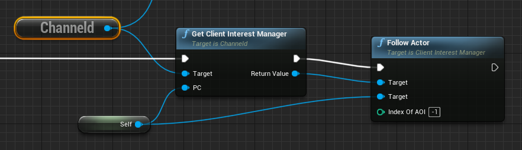
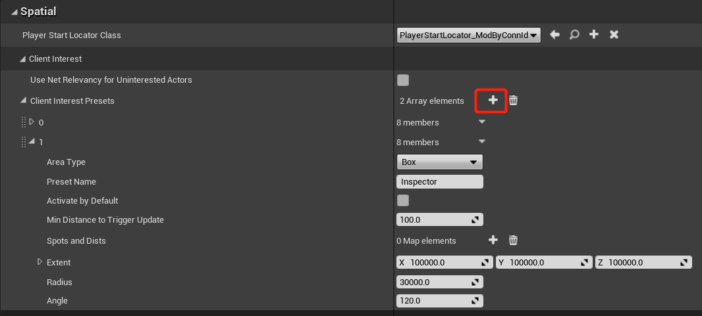

# Client Interest
## Introduction
Client interest refers to the game information that the client player can see and is replicated by the server, such as:
- Avatar, position, action of nearby players
- Position, health, etc. of NPCs
- Important world events, such as killing world bosses

In different game genres, game modes, or play mode, the client's interest may vary greatly, for example:
- In the top-down view, you can see a large area of the city or battlefield, and you can also zoom in the camera to see the details on the ground
- In the third-person camera, you can see things in front of the player character, and you can also rotate the camera to see the information behind the player character
- In a shooting game, when you open the aiming mirror of the gun, you can see the details far away, but at this time you cannot see anything behind you

While there are many ways to implement interest management in Unreal Engine, ChanneldUE implements a new framework to support the large open world multi-server architecture.

## Client Interest Management in ChanneldUE
The core of the large open world multi-server architecture of ChanneldUE is the [Spatial Channel](use-spatial-channel.md#71-introduction-to-spatial-channel). The entire world is divided into cells of the same size, each of which is a spatial channel and the smallest unit of interest in ChanneldUE. In other words, a client either subscribes to a spatial channel (cell) and can receive channel data updates; or does not subscribe and does not receive updates. Therefore, the size of the spatial channel cell is a parameter that developers need to consider carefully.

With the default 150-meter update range of UE as a reference, the recommended spatial channel cell size is between 50-100 meters (side length). Smaller cells can make handover (the player will subscribe and unsubscribe some spatial channels every time they pass through a spatial channel) smoother, but the higher the handover frequency, the higher the load of the channeld gateway service.

The update of the client interest is triggered only when the client is handed over by default. Developers can also enable interest following, that is, the client interest is updated immediately after the condition is met (such as moving a certain distance). This will also increase the system load, so it is recommended to enable interest following only in scenes where the interest area is very sensitive, such as when aiming with a sniper scope. The following screenshot shows how to enable interest following through Blueprint:



> Note: The logic of interest management is controlled by the UE server, and the channeld gateway service finally calculates and takes effect. So the logic in the above figure should happen on the UE server, not the client.

ChanneldUE has built-in the following types of interest areas (AOI, Area Of Interest):
- Cuboid area. All spatial channels in the cuboid area centered on the player. Parallel to the world coordinate axis and cannot be rotated. Suitable for top-down games.
- Spherical area. All spatial channels in the spherical area centered on the player. Suitable for third-person games.
- Cone area. All spatial channels in the cone area centered on the player. Suitable for telescope or sniper scope scenarios.
- Static locations. The location point will be mapped to the spatial channel, so it is equivalent to subscribing to a fixed spatial channel. This interest area type can be used to focus on a specific area on the map (such as the flag in the capture the flag mode).

The following table lists the parameters of the interest area and the types of interest areas to which they apply:
| Parameter | Default Value | Description | Applicable Types |
| ------ | ------ | ------ | ------ |
| `Preset Name` | Empty | Preset name. Used to find when calling the `ClientInterestManager` API | All types |
| `Activete By Default` | true | Whether to activate by default | All types |
| `Min Distance To Trigger Update` | 100.0 | The minimum distance to trigger an update after enabling interest following | Cuboid, Sphere, Cone |
| `Spots And Dists` | Empty | The list of location points and corresponding spatial distances. The closer the distance, the higher the update frequency. | Static Locations |
| `Extent` | X=15000.0, Y=15000.0, Z=15000.0 | Half the length of the cube side | Cuboid |
| `Radius` | 15000.0 | Radius | Sphere, Cone |
| `Angle` | 120.0 | The top angle of the cone (0-360). It should be slightly larger than the camera field of view to ensure that the objects observed by the player character can appear in time when the player character rotates | Cone |

The actual interest area of the client is the **combination** of the above interest areas. Developers can also extend the interest type by themselves. To add, delete, or modify the interest area, you need to open the `Project Settings -> Plugins -> Channeld`, and add a preset in `Spatial -> Client Interest -> Client Interest Presets`. The following example adds an interest area with a range of 1000 cubic meters and sets it to be off by default:



## Update Frequency of Interest Areas
The update frequency of all interest areas, that is, the frequency at which the corresponding spatial channel data is updated to the client, is uniformly controlled by a set of parameters in channeld:
```go
var spatialDampingSettings []*SpatialDampingSettings = []*SpatialDampingSettings{
    {
        MaxDistance:      0,
        FanOutIntervalMs: 20,
    },
    {
        MaxDistance:      1,
        FanOutIntervalMs: 50,
    },
    {
        MaxDistance:      2,
        FanOutIntervalMs: 100,
    },
}
```

The code means the update frequency of the spatial channel decays with the distance of the channel, which is 50Hz (distance is 0, that is, the same spatial channel), 20Hz (distance is 1 spatial channel), 10Hz (distance is 2 or more spatial channels). To change the update frequency of the spatial channel, you need to modify the `spatialDampingSettings` in the code [message_spatial.go](/../../../channeld/blob/master/pkg/channeld/message_spatial.go).

# Extending Interest Types
Your interest area class needs to inherit from `UAreaOfInterestBase` (not followable) or `UPlayerFollowingAOI` (followable), and implement the virtual method:
```cpp
virtual void SetSpatialQuery(channeldpb::SpatialInterestQuery* Query, const FVector& PawnLocation, const FRotator& PawnRotation) override;
```
The `Query` parameter is the spatial interest query object that is finally sent to Channeld; the `PawnLocation` and `PawnRotation` parameters are the position and rotation of the player character. You need to set the query parameters, such as the center point and radius, in `SetSpatialQuery`. The following example code is an implementation of a spherical interest area:
```cpp
ChanneldUtils::SetSpatialInfoPB(Query->mutable_sphereaoi()->mutable_center(), PawnLocation);
Query->mutable_sphereaoi()->set_radius(Radius);
```
Then, at runtime, you need to call `UClientInterestManager::AddAOI` to add it to the interest area management.

For followable interest areas, you can define when the spatial interest query object is updated by overriding the `TickQuery` method.

# Testing Interest Areas
The main way to observe the client interest area is to use the built-in spatial channel visualization tool in ChanneldUE. When enabled, the tool can display all spatial channels in the form of a grid, and the spatial servers are represented by different colors; at the same time, the spatial channels in the current client interest area (that is, subscribed) will be highlighted.

The following GIF shows the interest area of a cone area with following enabled. When the player character moves and rotates, the interest area will follow the change:

