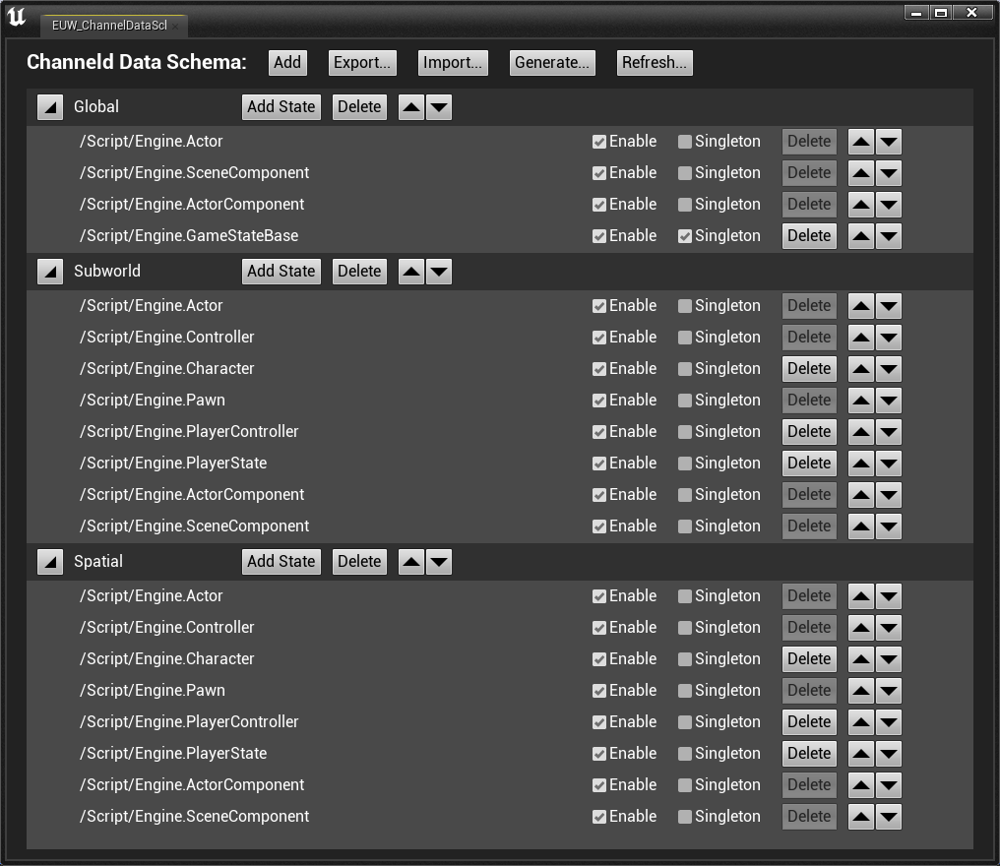
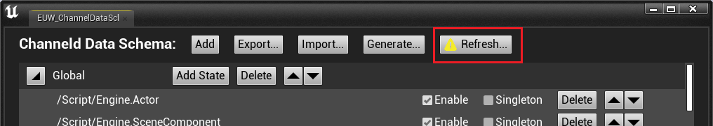
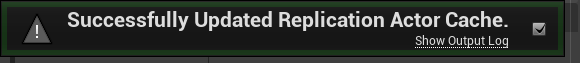
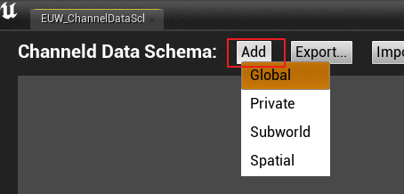
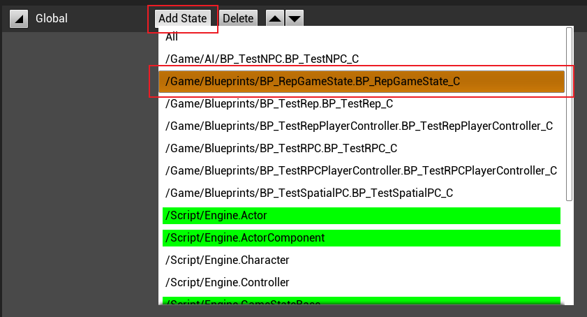
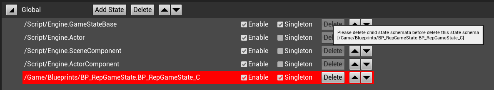

# 频道数据模型
## 什么是频道数据模型
频道数据模型定义了频道类型对应的频道数据的状态信息。channeld每次进行频道数据同步时，都会根据频道类型对应的频道数据模型进行同步。

## 频道数据模型的结构
每种频道类型对应频道数据模型由若干频道数据状态组成。频道数据状态是指同步Actor、ActorComponent的状态。一个频道数据状态在一个频道数据中可以是单例的，也可以多例的。
>通常GameState、worldSetting等在GamePlay开发过程中保持一个服务器仅一份实例单例的同步Actor时，该同步Actor的状态在频道数据模型为单例。

## 频道数据模型编辑器
频道数据模型的定义是用json文件描述的，但是不推荐您直接对json文件进行修改，而是使用更加便捷的编辑器进行编辑。

### 打开编辑器

如下图所示，点击ChannelUE插件的`Editor Channel Data Schema...` 按钮，打开频道数据模型编辑器。

打开的编辑器如下图所示：

>当您在新项目中第一次打开频道数据模型编辑器时，会自动创建默认的频道数据模型。

### 频道数据模型的保存
频道数据模型的编辑器会自动保存，当您修改频道数据模型时，会自动保存频道数据模型到项目根目录下的`Config/ChanneldChannelDataSchema.json`文件中。

### 更新同步Actor缓存
当项目中新增或删除了同步Actor、ActorComponent时，需要更新同步Actor缓存，以便编辑器能够正确的显示频道数据状态的选项。

如同下图所示，在频道数据编辑器上方点击`Refresh...`按钮，更新同步Actor缓存。

>当您从未更新过同步Actor缓存，或项目中有任何资产发生了变化时，按钮左侧会有一个警告图标，用于提示您需要更新同步Actor缓存。但是您可以按照自己的需求来决定是否需要更新同步Actor缓存。

等待一段时间，当Unreal Engine编辑器右下角提示`Successfully updated rep actor cache`时，表示更新成功。

更新完成后，就可以为频道数据模型新增频道数据状态了。

### 新增频道数据模型
如同下图所示，在频道数据编辑器上方点击`Add`按钮，选中子菜单中的需要新增的频道数据模型，即可新增频道数据模型。

### 删除频道数据模型
如同下图所示，在需要被删除的频道数据模型项点击`Delete`按钮，即可删除频道数据模型。

### 新增频道数据状态
当您在项目中新增了一个同步Actor、ActorComponent时，并希望它能够在某个频道中进行同步时，需要在频道数据模型中新增一个频道数据状态。

如同下图所示，在需要添加频道数据状态的频道数据模型项点击`Add`按钮，选中子菜单中的需要新增的频道数据状态，即可新增频道数据状态。

>在选择需要添加的频道数据状态时会高亮其（带有同步属性的）父类以及使用的（带有同步属性的）组件，当添加该频道数据状态时，会自动添加其（带有同步属性的）父类以及使用的（带有同步属性的）组件。

### 配置频道数据状态
如同下图所示，频道数据状态可以为频道数据状态配置三项属性：

* 启用（Enable）：是否在所属的频道数据中启用该频道数据状态。
* 单例（Singleton）：是否为单例的频道数据状态。
* 顺序（⏶|⏷）：频道数据状态的顺序。

### 删除频道数据状态
如同下图所示，在需要被删除的频道数据状态项点击`Delete`按钮，即可删除频道数据状态。

>如果被删除的频道数据状态的子类或者组件的使用者是该数据频道模型的状态，那么需要先删除其子类或组件的使用者吃能将其自己删除。
>* 下图所呈现的是想要删除GameStateBase的频道数据状态，但是由于GameStateBase的子类BP_RepGameState是该频道数据模型的状态，所以需要先删除BP_RepGameState才能将GameStateBase删除。
>
>
>
>* 下图呈现的是想要删除SceneComponent的频道数据状态，但是由于BP_RepGameState和Actor都使用了SceneComponent组件，所以需要先删除BP_RepGameState和Actor才能将SceneComponent删除。
>
>

### 导入、导出频道数据模型

* 导入频道数据模型
在频道数据编辑器上方点击`Import...`按钮，选择需要导入的频道数据模型json文件，即可导入频道数据模型。

* 导出频道数据模型
在频道数据编辑器上方点击`Export...`按钮，选择需要导出的频道数据模型json文件，即可导出频道数据模型。