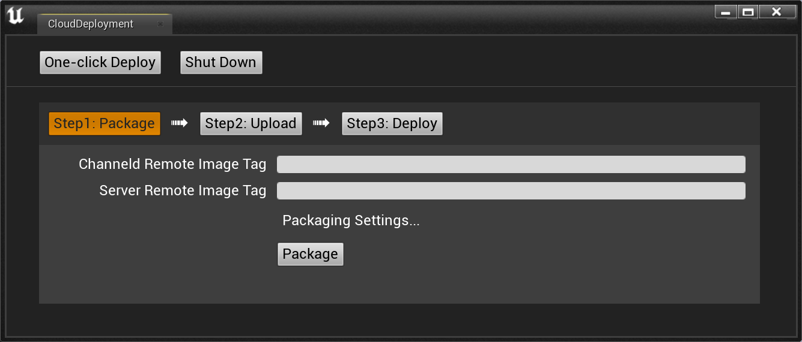
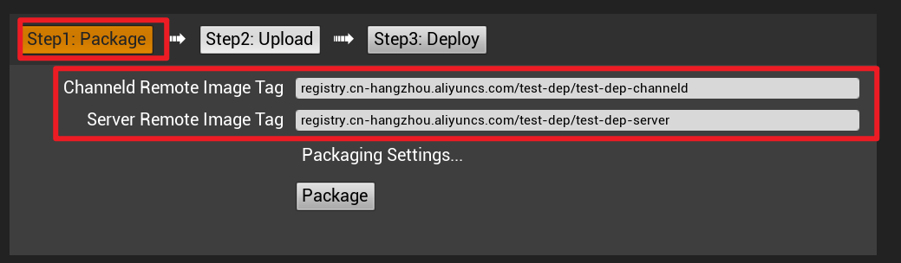
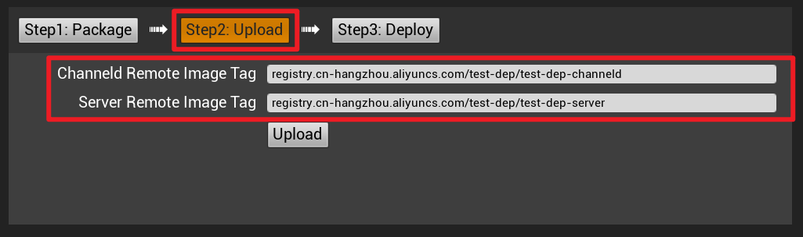
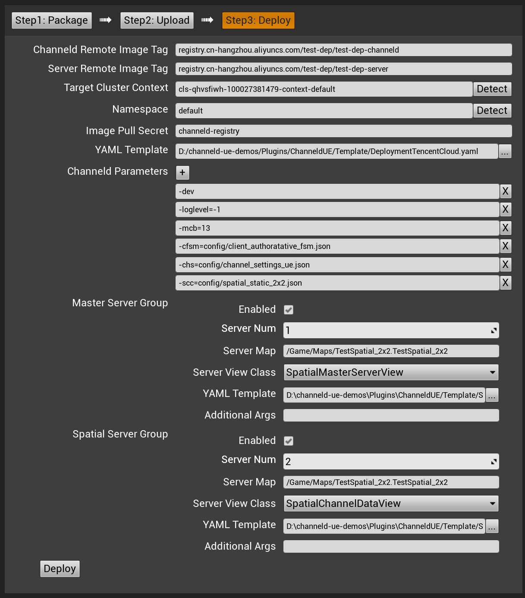
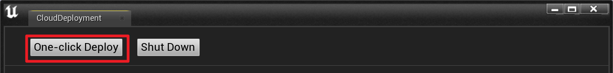
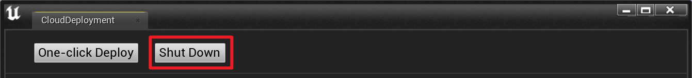

# 推荐工作流

## 本地开发迭代

### 使用原生UE进行开发迭代
在日常的开发中，推荐先使用[原生UE网络同步](https://docs.unrealengine.com/4.27/zh-CN/InteractiveExperiences/Networking/Actors/)进行GamePlay的开发和调试。在实现GamePlay功能后再开启ChanneldUE网络同步进行开发和调试。这样可以避免频繁地生成同步代码、启动专用服务器和网关。
>使用原生UE网络同步时请确保已关闭ChanneldUE的网络同步：
>
>

### 使用ChanneldUE网络同步进行测试

开启ChanneldUE网络同步，使原生UE的网络同步切换到ChanneldUE网络同步：


#### 为Actor开启基于ChanneldUE的同步
使用了网络同步或RPC的Actor需要添加同步组件。具体操作如下：
* 为C++ Actor添加同步组件
    1. Actor 类中声明`ChanneldReplicationComponent`组件：
    ```
    #include "Replication/ChanneldReplicationComponent.h"
    ...
    class XXX_API ACppActor : public AActor
    {
        GENERATED_BODY()
    protected:
        UPROPERTY()
        UChanneldReplicationComponent* ChanneldReplicationComponent;
        ...
    };
    ```

    2. Actor 的构造函数中实例化`ChanneldReplicationComponent`组件：
    ```
    ACppActor::ACppActor()
    {
        ChanneldReplicationComponent = CreateDefaultSubobject<UChanneldReplicationComponent>(TEXT("ChanneldReplication"));
    }
    ```

* 为蓝图Actor中添加同步组件

    

##### 批量添加同步组件
除手动为同步Actor添加同步组件外，ChanneldUE提供了工具为已有项目中的Actor批量添加同步组件：


>注意：该工具会加载项目中所有的Actor，如果项目中有大量的Actor，可能会导致加载时间过长。

#### 配置频道数据模型
为同步Actor添加同步组件后，还需要配置频道数据模型来映射同步Actor和频道数据的关系。
>频道数据模型详细说明和使用可参考[频道数据模型](./channel-data-schema.md)

点击ChannelUE插件的`Editor Channel Data Schema` 按钮：


将会打开如下编辑器窗口：


##### 将Actor状态添加到频道数据模型
首先，如果同步缓存过期（出现黄色叹号），需要先对其进行更新。在频道数据编辑器上方点击`Refresh...`按钮：


同步缓存更新完成后，将新增的同步Actor映射到某一个频道数据下：（下图演示将`BP_TestRep`映射到全局频道。因为`BP_TestRep`依赖`StaticMeshComponent`组件，所以该组件也被同时添加到全局频道）

##### GameState
通常GameState在服务器中只有唯一的实例，因此可以将GameState的状态设置为单例：


>在多服情况下建议将GameState的状态放到Global频道中并设置为单例，以保证GameState的状态在所有的服务器中保持一致。
>除了GameState外，如WorldSettings等都是单例，同样建议将其状态设置为单例。

#### 生成同步代码
在频道数据编辑器上方点击`Generate...`按钮即可生成同步代码：
配置完成频道数据模型后，需要生成C++的同步代码。同步代码主要是用来实现频道数据模型中的状态同步。


##### 热编译兼容模式
ChannelUE提供了热编译兼容模式，该模式下每次生成同步代码后自动热编译项目源码，如果关闭了热编译兼容模式，在下次运行游戏前，需要关闭UE编辑器并重新编译项目代码。


>热编译兼容模式下每次生成的同步代码都会存在差异，所以在发布前建议关闭热编译兼容模式再生成一次同步代码。

### 本地测试
由于ChanneldUE采用了分布式专用服务器的架构，所以在本地测试时需要启动channeld网关和多个专用服务器。ChanneldUE提供了相关的启动工具。

通过插件的下拉菜单开启网关和专用服务器，步骤如下：


<!-- ，但是请先确保`Launch Channeld`成功开启网关后再通过`Launch Servers`开启专用服务器。 -->
1. 确保开启了ChanneldUE的同步功能
2. 点击`Launch Channeld`开启channel网关

    channeld网关开启成功会有如下输出：
    

3. 点击`Launch Servers`开启专用服务器

#### 测试多个客户端
如果要同时开启多个客户端，需要对默认的编辑器设置做一些修改。打开主菜单`编辑 -> 编辑器偏好设置 -> 关卡编辑器 -> 播放`，在`Multiplayer options`中，**取消**`单进程下的运行`的勾选：


#### 关闭专用服务器和网关
测试完成后，可以通过插件的二级菜单关闭专用服务器和网关，依次点击`Stop Servers`和`Stop Channeld`即可关闭专用服务器和网关。


## 协作和版本控制

### 频道数据模型
#### 频道数据模型定义文件
频道数据模型定义文件建议通过版本控制工具进行版本控制，以保证多人协作时，生成的同步代码是一致的。频道数据模型定义文件路径为`Config/ChanneldChannelDataSchema.json`。

#### 配置频道数据模型
如果在配置频道数据模型之前通过版本控制变更了项目代码，那么请先[更新一次同步Actor缓存](#新增Actor)以确保频道数据状态能正确的显示在频道数据编辑器中。

### 同步代码

#### 重新生成一次同步代码
在UE编辑器**未开启**时，通过版本控制更新了项目代码，建议执行如下操作：
1. 手动删除位于`Source/<游戏模块>/ChanneldGenerated`目录下的文件
2. 编译并运行项目
3. [生成同步代码](#生成同步代码)
>如使用git作为版本控制工具，可以在项目根目录下的`.git/hooks/post-merge`脚本中添加删除`Source/<游戏模块>/ChanneldGenerated`目录的逻辑。

在UE编辑器**已开启**时，通过版本控制更新了项目代码后，需要重新[生成同步代码](#生成同步代码)。

#### 无需上传至版本控制
##### 同步代码
推荐将ChanneldUE生成的同步代码忽略，以免版本控制工具将其纳入版本控制中。
>如使用git作为版本控制工具，可以在项目根目录下的`.gitignore`文件中添加如下内容：
>```
># ChanneldUE生成的同步代码
>/Source/**/ChanneldGenerated
>```

##### channeld网关
通常，channeld网关不会纳入版本控制。但是当开发者需要修改channeld网关源码并将其纳入版本控制时，推荐将ChanneldUE生成的同步代码忽略：

>如使用git作为版本控制工具，可以在channeld网关根目录下的`.gitignore`文件中添加如下内容：
>```
># ChanneldUE生成的同步代码
>channeldue.gen.go
>*.gen.go
>```

## 云部署
ChanneldUE使用提供方便的工具来将channeld网关和游戏服务器部署到集群。点击ChannelUE插件的`Cloud Deployment` 按钮打开：



>云部署工具的的详细使用说明请参考[云部署工具](cloud-deployment-tool.md)。

### 三步部署
第一次部署使用云部署工具时推荐先按照三步部署的方式部署，以便快速定位部署过程中出现的问题。
#### Step 1: 打包


点击`Step 1: Package`按钮，就会切换到打包界面。填写`Channeld Remote Image Tag`和`Server Remote Image Tag`，确保本地已经开启了`Docker Engine`，然后点击`Package`按钮开始打包。

>如果`Channeld Remote Image Tag`和`Server Remote Image Tag`没有指定标签，那么默认会使用`latest`标签。

>打包游戏服务器时会使用`Project Settings`的`Packaging`的设置，如需修改打包设置可以点击`Packaging Settings...`链接。

#### Step 2: 上传

点击`Step 2: Upload`按钮，就会切换到上传界面。如果第一次切换到上传界面，则该界面的`Channeld Remote Image Tag`和`Server Remote Image Tag`会根据打包界面的输入自动填充。填写完成后点击`Upload`按钮开始上传。

>如果上传的镜像为私有镜像且本地未记录访问凭证，则在上传过程中会提示使用账号密码进行登录

#### Setp 3: 部署

点击`Step 3: Deploy`按钮，就会切换到部署界面。如果第一次切换到部署界面，则该界面的`Channeld Remote Image Tag`和`Server Remote Image Tag`会根据上传界面的输入自动填充。
* 点击`Target Cluster Context`的`Detect`，自动检测当前的集群上下文
* 点击`Namespace`的`Detect`，自动检测当前的集群命名空间
* 如果指定镜像是私有镜像，则需要填写`Image Pull Secret`，否则会导致部署失败
* 在`Channeld Parameters`中设置channeld网关的启动参数
* 在`Master Server Group`和`Spatial Server Group`的`Server Map`中输入需要运行的地图资源路径
* 在`Spatial Server Group`的`Server Num`中输入需要运行的空间服务器数量
* 填写完成后点击`Deploy`按钮开始部署

>`Image Pull Secret`对应的`Secret`需要通过kubectl创建，或是通过云供应商的控制面板创建。

>如果部署单游戏服务器，请将`Spatial Server Group`的`Enable`设置为`false`。

### 一键部署


填写完`Step 1: Package`、`Step 2: Upload`和`Step 3: Deploy`的参数后，可以点击`One Deploy`按钮一键自动进行打包、上传和部署。

### 结束部署


点击`Shut Down`将会删除集群中的channeld网关和所有游戏服务器。
