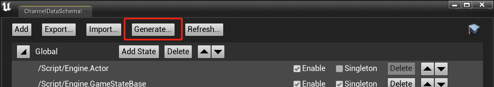
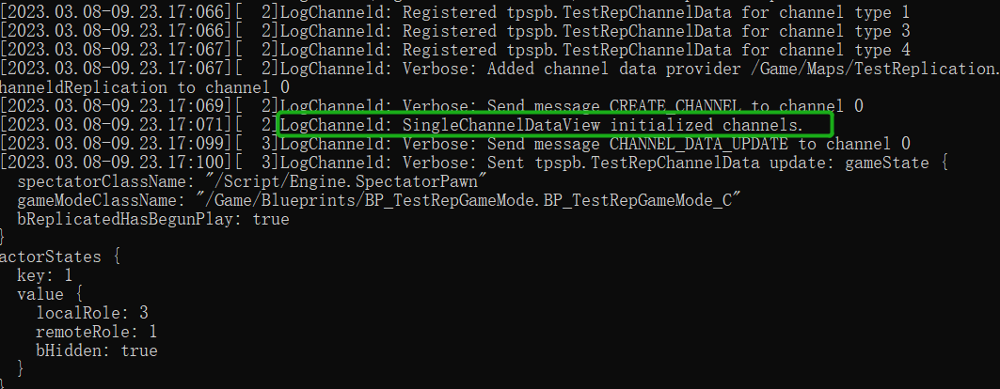

# 运行第三人称模板项目
[上一章](installation.md)介绍了如何为项目安装和启用ChanneldUE插件。插件启用后，运行游戏仍然会使用UE的原生网络框架。本章将介绍如何让项目运行在ChanneldUE的网络框架上。

## 2.3.为项目创建基础同步类和Game Mode
因为项目默认用到的Gameplay框架并不支持基于channeld的网络同步，所以需要创建一批添加了同步组件的蓝图类。

##### 2.3.1.为第三人称角色蓝图添加同步组件
打开第三人称角色的蓝图`ThirdPersonCharacter`，并为其添加同步组件`ChanneldReplicationComponent`：


##### 2.3.2.创建`PlayerController`、`GameState`和`PlayerState`蓝图
创建三个蓝图，他们分别继承自`PlayerController`、`ChanneldGameState`和`PlayerState`，并分别将它们命名为`ThirdPersonPlayerController`、`ThirdPersonGameState`和`ThirdPersonPlayerState`：


```
提示：此处选择GameStateBase或ChanneldGameState都可以。如果要在之后的开发中使用到跨服的GameState功能，则需要选择ChanneldGameState。
```

##### 2.3.3.为新创建的蓝图开启同步
仿照2.3.1.步骤，为新创建的三个蓝图开启`复制(Replicates)`，并添加同步组件`ChanneldReplicationComponent`。

```
小贴士：记得在开启Relicates和添加同步组件后，编译和保存上述蓝图！
```

 ##### 2.3.4.创建`GameMode`蓝图
创建一个新的GameMode蓝图`ThirdPersonGameMode`（如果已存在，则打开），将`Game State Class`, `Player Controller Class`, `Player State Class`和`Default Pawn Class`分别设置为`ThirdPersonGameState`、`ThirdPersonPlayerController`、`ThirdPersonPlayerState`和`ThirdPersonCharacter`：


##### 2.3.5.应用GameMode蓝图
在项目设置中将`ThirdPersonGameMode`设置为默认Game Mode


# 3.配置插件
## 3.1.配置频道数据视图
频道数据视图是ChanneldUE插件的核心概念之一。它主要用于关联同步对象（角色，控制器，Game State等）与频道数据。UE客户端和服务端都会存在一个视图对象。
接下来，打开主菜单`编辑 -> 项目设置 -> 插件 -> Channeld`，我们需要为项目设置一个默认视图：


`SingleChannelDataView`是插件中内置的视图蓝图类，它会在服务端创建**全局频道**，并在客户端连接成功后订阅到该频道。订阅成功后，客户端发送的网络数据会通过channeld转发到全局频道的所有者，即创建该频道的服务端。

## 3.2.配置服务器组
作为UE的分布式架构扩展，ChanneldUE插件支持同时启动多个UE服务器进程，每个进程可以配置自己的视图和启动参数。

要添加一个服务器组，打开主菜单`编辑 -> 编辑器偏好设置 -> 插件 -> Channeld Editor`。点击`Server Groups`一栏的加号按钮，并展开设置项：


确保Enabled为勾选，Server Num为1，并设置Server View Class同样为`SingleChannelDataView`。Server Map留空则表示启动服务器时，会使用编辑器当前打开的地图。

# 4.启动channeld服务和游戏服务器
第一次启动channeld服务和游戏服务器前需要生成同步代码，点击`Generate Replication Code`选项，生成同步代码。首次生成时要遍历项目中所有的代码和蓝图，所以可能较长，请耐心等待。



等待代码生成成功后，点击工具栏中插件图标的下拉按钮，确保`Enable Channeld Networking`为选中状态：


然后，点击`Launch Channeld`选项，启动channeld服务（如上图中标记2所示）。如果弹出Windows防火墙提示，请允许channeld通过防火墙。

最后，点击`Launch Servers`选择，启动游戏服务器（如上图中标记3所示）。此时每一个命令行窗口，都对应一个UE服务器进程。正常启动的UE服务器进程，会在控制台中打印以下类似信息：



```
注意：如果UE服务器连接channeld失败，则会退出。
```

# 5.运行游戏并测试
## 5.1.测试单个客户端
确保在`运行Standalone`网络模式下运行游戏。此时客户端尚未连接到channeld，需要手动连接。在客户端的控制台中输入`open 127.0.0.1`并回车。观察到客户端重新加载地图并创建角色，说明连接成功。

在地图中移动角色，并观察服务器的控制台中打印的日志，会出现对应的同步数据输出：


## 5.2.测试多个客户端
如果要同时开启多个客户端，需要对默认的编辑器设置做一些修改。打开主菜单`编辑 -> 编辑器偏好设置 -> 关卡编辑器 -> 播放`，在`Multiplayer options`中，**取消**`单进程下的运行`的勾选：


```
原理：在网络底层，ChanneldConnection类负责和channeld网关服务进行连接，并进行创建、订阅、退订频道等操作。
因为一个UE或UE编辑器进程只能存在一个ChanneldConnection对象，所以在单进程下，同时存在多个客户端或服务端会出现错误。
```

此时，增加玩家数量并运行游戏。第一个客户端窗口会立刻出现；其它客户端窗口会稍后出现，因为它们都是单独的UE进程，需要一些时间启动。

在每个客户端窗口中，打开控制台并输入`open 127.0.0.1`。观察多个客户端之间的同步。

```
提示：在本章后面的空间频道示例中，会介绍如何在蓝图中建立连接。
```

## 下一步
在下面的章节里，将介绍如何在ChanneldUE的网络框架中添加新的同步Actor。[点击这里](add-replication.md)继续。