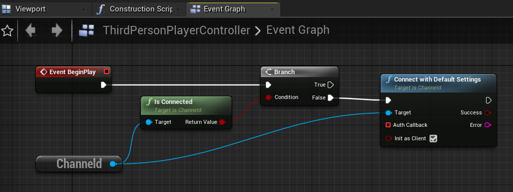

# 7.使用空间频道运行地图
[上一章](add-replication.md)介绍了使用ChanneldUE进行网络开发的基本工作流。本章将介绍如何将第三人称模板项目的地图切分到两个UE服务器上运行。

## 7.1.空间频道简介
前面在配置频道数据视图时提到了频道的概念——频道是订阅和状态数据的集合。订阅是指哪些连接（包括客户端和服务端）关心该频道的状态数据更新；状态数据则是游戏中的需要同步的对象（比如Actor，Character，PlayerController等）的同步属性的集合。

开发者可以定义游戏中包含哪些频道，以及每种频道的状态数据的结构。常见的频道类型有：
- 全局频道：所有连接都订阅该频道。状态数据一般为所有玩家共享，如世界时间。
- 子世界频道：在空间上隔离的游戏世界，如MMO中的副本，或一局游戏的房间。每个子世界视频对应一个UE服务器进程。
- 空间频道：在空间上联通的游戏世界，适用于将较大的地图分割为多个区域。每个区域对应一个UE服务器进程。

空间频道相较于子世界频道，因为它在空间上是联通的，所以玩家在频道之间切换，不需要重新加载地图，也不需要重新连接到服务器。这样，可以大大减少玩家在切换频道时的等待时间，提升游戏体验。

空间频道有很多实现方式，从最简单的静态网格切分，到复杂的基于负载的动态切分。channeld内置提供了一种简单的静态网格切分的实现，开发者可以根据自己的需求，自行实现更复杂的切分方式。

下面将介绍如何在UE中通过配置的方式使用空间频道。示例中将使用4个空间频道，每个频道大小为2000x2000；每2个空间频道运行在一个UE服务器上（称为“空间服务器”），所以共有2个空间服务器。这个空间频道配置内置在channeld中，并作为ChanneldUE的默认配置。

## 7.2.在项目设置中配置空间频道
打开主菜单`编辑 -> 项目设置 -> 插件 -> Channeld`，将Channel Data View Class改为`SpatialChannelDataView`。该类会成为客户端使用的频道数据视图类。

为了让空间频道更直观地显示出来，在相同的设置界面中勾选`Spatial -> Debug -> Enable Spatial Visualizer`，开启ChannelUE内置的空间频道可视化工具：


空间频道可视化工具可以为角色增加不同颜色的描边，已区分角色所在的空间频道。要开启描边功能，需要在主菜单`编辑 -> 项目设置 -> 引擎 -> 渲染 -> Postprocessing`中设置`自定义深度-模具通道`为`以模具启用`：


接下来，还需要配置服务端使用的频道数据视图类。

## 7.3.在编辑器设置中配置主服务器和空间服务器
在7.1.中介绍过，空间频道运行于空间服务器上，一个空间服务器可以对应一到多个空间频道。然而一个游戏世界背后的服务器往往不止有空间服务器，因为像玩家进入游戏后初始位置（即所属空间频道）的分配、全局的状态管理（如GameState）等逻辑，都需要一个跨越空间的服务器来处理，这个服务器在channeld中被称为**主服务器**。主服务器即全局频道的所有者。

打开主菜单`编辑 -> 编辑器偏好设置 -> 插件 -> Channeld Editor`。在`Server Groups`中，将第一服务器组的视图类(Server View Class)改为`SpatialChannelDataView`。

接下来，点击`Server Groups`右侧的加号，添加一个新的服务器组。将新的服务器组的视图类(Server View Class)改为`SpatialSpaceServerView`。将服务器数量(Server Num)改为2，表示有两个空间服务器。将启动延时(Delay Time)改为2.0秒，保证主服务器启动后，再启动空间服务器。设置好的服务器组如下图所示：


## 7.4.修改玩家控制器蓝图，实现自动连接channeld
在步骤5中，介绍了通过控制台输入`open 127.0.0.1`连接channeld的方法。在空间频道的场景中，这种方式就不再适用了。事实上，大部分情况下都推荐使用C++或蓝图实现自动连接channeld。下面是通过蓝图连接channeld的示例：

打开`ThirdPersonPlayerController`蓝图，先添加一个`Get ChanneldGameInstanceSubsystem`节点。然后在`BeginPlay`事件中添加以下节点：



## 7.5.运行游戏并测试
重复步骤4，重启channeld服务和游戏服务器。可以观察到，3个UE服务器进程依次启动。其中2个空间服务器进程在启动成功后，会打印出创建空间频道成功的日志：

```log
LogChanneld: Created spatial channels: 65536,65537 （空间服务器1）
LogChanneld: Created spatial channels: 65538,65539 （空间服务器2）
```

运行游戏后，客户端会自动连接到channeld并进入游戏服务器。可以观察到空间频道可视化工具带来的效果：
- 地板上会显示不同颜色的色块和网格。一种颜色表示同一个空间服务器；每个网格表示一个空间频道。
- 空气中会填充不同的半透明颜色，表示客户端所订阅的空间频道，即兴趣范围。**客户端接收不到兴趣范围之外的同步**。
- 玩家角色的身上会出现亮边，颜色对应该角色所属的空间服务器。


在场景中移动，跨过地板上的网格。可以观察到：跨过同一颜色的网格，兴趣范围也会随着移动；角色的亮边颜色不会改变，因为并没有发生跨服；而跨过不同颜色的网格，角色的亮边会改变为所在空间服务器的颜色，因为发生了跨服。

# 8.总结
恭喜你！到这里，你已经了解了ChanneldUE的基本功能。如果想要深入理解channeld的概念，可以浏览[基本概念](basic-concepts.md)章节；如果想要动手尝试更多的功能，比如：
- 配置更多空间服务器来运行更多的空间频道
- 控制客户端接收的同步范围
- 让GameState在多个空间服务器上同步属性

可以浏览后面的进阶主题；也可以下载[ChanneldUE示例项目](https://github.com/metaworking/channeld-ue-demos)。
