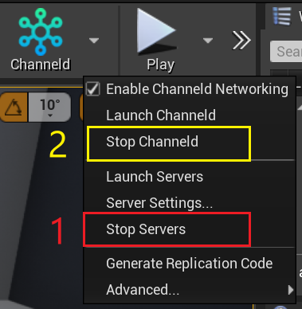

# 6.添加网络同步Actor
[上一章](third-person-template.md)介绍了如何使用ChanneldUE的网络框架运行项目。本章将通过介绍网络开发中最常见的操作——添加一个同步Actor，来演示在工作流上和原生UE的兼容性。

## 6.1.创建有同步变量的Actor
新建一个Actor蓝图`BP_TestActor`，并为其添加同步组件`ChanneldReplicationComponent`。Actor默认不开启同步，需要在组件中手动勾选`Replicates`选项：


接下来，为该Actor添加一个`Cube`组件，使其可见。由于接下来要通过蓝图实现该Cube的位移和旋转，所以需要开启Cube组件的网络同步：


然后，为该Actor添加一个同步变量`Size`，类型为`Float`，设置Replication为`RepNotify`，开启同步及回调：


在Size的同步回调函数`On Rep Size`中，打印出同步的值：


## 6.2.在蓝图中实现移动逻辑
在`BP_TestActor`的事件图表中，为Tick事件添加如下节点，使`Cube`组件可以随着时间上下移动和旋转：


```
注意：添加IsServer节点，确保只有服务端才会执行该逻辑。
```

## 6.3.在玩家控制器中实现创建Actor的逻辑
在`ThirdPersonPlayerController`中，添加如下节点，使玩家按下`F`键时，在角色前方创建一个`BP_TestActor`，并为其设置一个随机的Size：


```
注意：ServerSpawnCube函数需要设置为“在服务器上运行”。这样创建出来的Actor才会出现在其它客户端。

另外，调用SpawnActor函数的参数中，需要设置Owner为当前控制器。这样的话，之后的跨服示例才能正常工作。
```

## 6.4.生成同步代码
因为我们在上面的步骤里添加了新的同步类和变量（`BP_TestActor`），以及为已有的同步类添加了RPC（`ThirdPersonPlayerController`），所以需要添加同步相关代码。

在ChanneldUE中，已经内置了Actor，Character，PlayerController等常用类的同步代码，所以我们只需要为新添加的`BP_TestActor`和`ThirdPersonPlayerController`生成同步代码。

首先，点击插件工具栏中的`Stop Servers`关闭之前开启的游戏服务器。然后，点击`Stop Channeld`关闭之前开启的channeld服务：



然后，点击`Generate Replication Code`选项，生成同步代码。首次生成时间要遍历项目中所有的代码和蓝图，所以可能较长，请耐心等待。

代码生成后，会自动编译。编译成功，则整个生成步骤完毕。下面可以进入游戏看看效果了。

```
注意：每次进行同步相关的修改后（包括：增删改名同步类，同步变量，或RPC），都需要重新生成同步代码。
```

## 6.5.启动服务器并测试
重复步骤4，启动channeld服务和游戏服务器。然后，重复步骤5，运行游戏并连接到服务器。

连接成功后，按下`F`键，可以看到在角色前方创建了一个`BP_TestActor`，并在屏幕左上方打印出`Size`的值：


## 下一步
在下面的章节里，将介绍如何通过多个UE服务器来运行同一个地图。[点击这里](use-spatial-channel.md)继续。