# 运行环境要求
ChanneldUE插件目前仅在Windows 10/11操作系统+UE 4.27下进行过测试。在其它环境下可能会出现未知的问题。

# 1.安装ChanneldUE插件
## 1.1.克隆代码仓库
使用git命令行工具克隆代码仓库到本地：
```bash
git clone https://github.com/channeld/channeld-ue-plugin.git
```

## 1.2.初始化插件
运行插件根路径下的`Setup.bat`脚本，该脚本会自动下载并安装插件所需的依赖项，包括：
```
golang - 用于运行channeld
channeld - 网关服务
protoc-gen-go - Protobuf的go代码生成工具
```

# 2.创建第三人称模板项目
## 2.1.创建项目并复制插件
新建一个基于第三人称模板的UE蓝图项目：在Unreal Project Browser中选择"Game" -> "Third Person" -> "C++"。

```
注意：ChannelUE插件只支持C++项目。如果您使用的是纯蓝图项目，需要先转换为C++项目。
```

项目创建后，关闭UE编辑器。将1.1.步骤中克隆的插件代码仓库目录复制到项目的`Plugins`目录下。

修改项目Build.cs文件，添加插件的模块`ChanneldUE`和`ProtobufUE`：
```csharp
PublicDependencyModuleNames.AddRange(new string[] { "Core", "CoreUObject", "Engine", "InputCore", "ChanneldUE", "ProtobufUE" });
```

## 2.2.重新编译运行项目并开启插件
在文件浏览器中右键点击项目的`*.uproject`文件，选择"Generate Visual Studio project files"，重新生成项目的解决方案文件。
在Visual Studio中重新加载解决方案，并编译运行项目。当UE编辑器再次打开时，工具栏会出现插件图标：

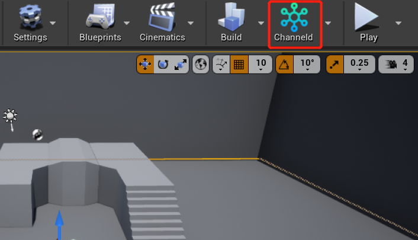

如果插件图标未显示，在编辑器的顶部菜单栏中选择"Plugins" -> "ChanneldUE" -> "Enable"，启用插件。

## 2.3.为项目创建基础同步类和Game Mode
接下来，因为项目默认用到Gameplay框架并不支持基于channeld的网络同步，所以需要创建一批添加了同步组件的蓝图类。

首先，打开第三人称角色的蓝图`ThirdPersonCharacter`，并为其添加同步组件`ChanneldReplicationComponent`：

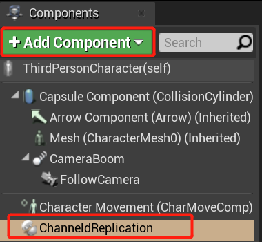

然后，新建第三人称控制器的蓝图`ThirdPersonPlayerController`，在类默认值中勾选`复制(Replicates)`，并为其添加同步组件：


接下来，因为`GameStateBase`和`PlayerState`分别负责同步游戏和玩家中的状态，还需要创建分别为它们创建蓝图类，并同样地，开启`复制(Replicates)`，添加同步组件：

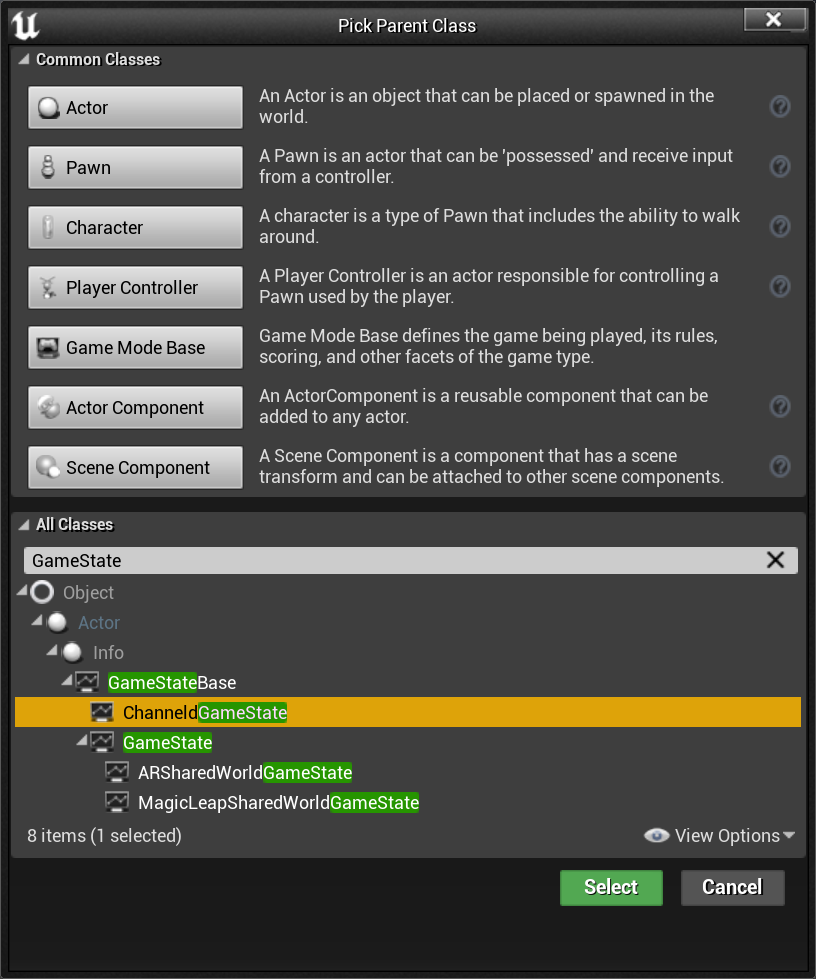

```
提示：此处选择GameStateBase或ChanneldGameState都可以。如果要在之后的开发中使用到跨服的GameState功能，则需要选择ChanneldGameState。
```

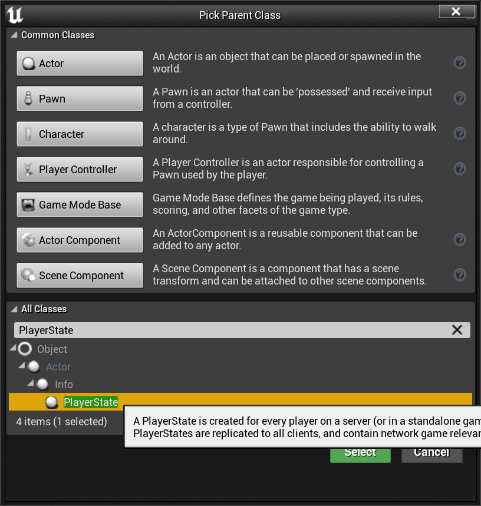


```
小贴士：记得在开启Relicates和添加同步组件后，编译和保存上述蓝图！
```

最后，添加一个新的GameMode蓝图`ThirdPersonGameMode`（如果已存在，则打开），并为其设置Game State Class, Player Controller Class, Player State Class和Default Pawn Class：


在项目设置中,将`ThirdPersonGameMode`设置为默认Game Mode：

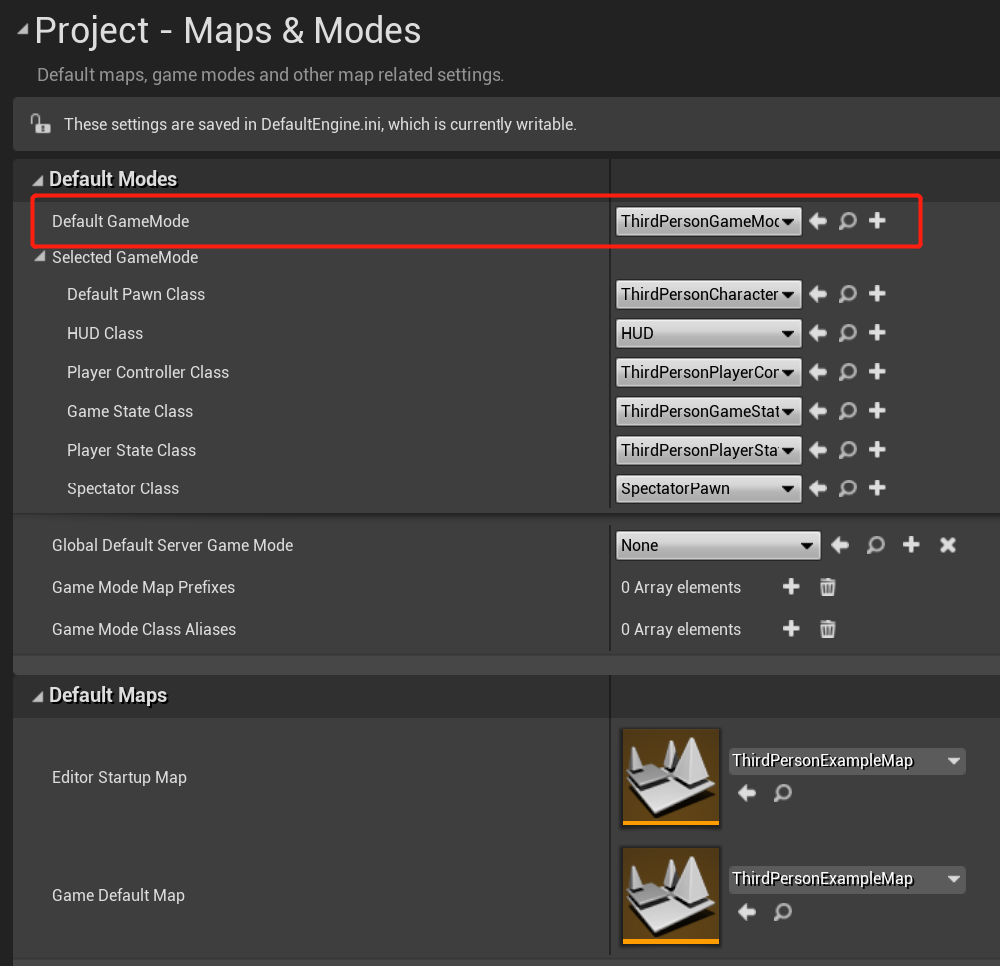

# 3.配置插件
## 3.1.配置频道数据视图
频道数据视图是ChanneldUE插件的核心概念之一。它主要用于关联同步对象（角色，控制器，Game State等）与频道数据。UE客户端和服务端都会存在一个视图对象。
接下来，打开主菜单`编辑 -> 项目设置 -> 插件 -> Channeld`，我们需要为项目设置一个默认视图：

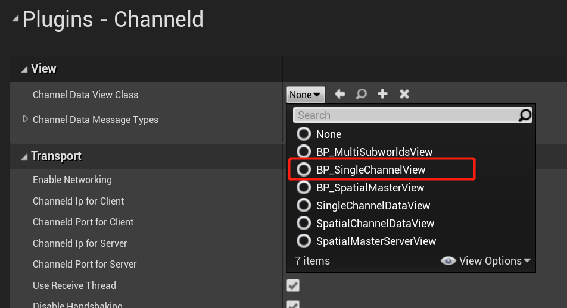

`SingleChannelDataView`是插件中内置的视图蓝图类，它会在服务端创建**全局频道**，并在客户端连接成功后订阅到该频道。订阅成功后，客户端发送的网络数据会通过channeld转发到全局频道的所有者，即创建该频道的服务端。

## 3.2.配置服务器组提示
作为UE的分布式架构扩展，ChanneldUE插件支持同时启动多个UE服务器进程，每个进程可以配置自己的视图和启动参数。
要添加一个服务器组，打开主菜单`编辑 -> 编辑器偏好设置 -> 插件 -> Channeld Editor`。点击`Server Groups`一栏的加号按钮，并展开设置项：

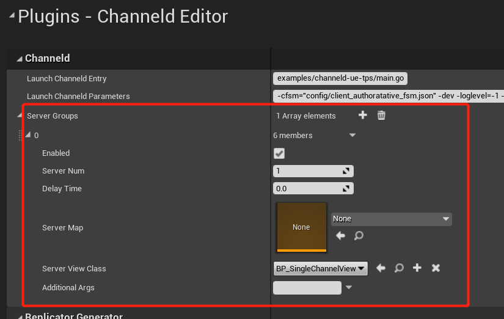

确保Enabled为勾选，Server Num为1，并设置Server View Class同样为`SingleChannelDataView`。Server Map留空则表示启动服务器时，会使用编辑器当前打开的地图。

# 4.启动channeld服务和游戏服务器
点击工具栏中插件图标的下拉按钮，确保`Enable Channeld Networking`为选中状态：

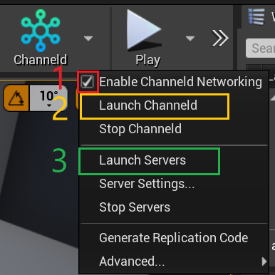

然后，点击`Launch Channeld`选项，启动channeld服务（如上图中标记2所示）。如果弹出Windows防火墙提示，请允许channeld通过防火墙。

最后，点击`Launch Servers`选择，启动游戏服务器（如上图中标记3所示）。此时每一个命令行窗口，都对应一个UE服务器进程。正常启动的UE服务器进程，会在控制台中打印以下类似信息：

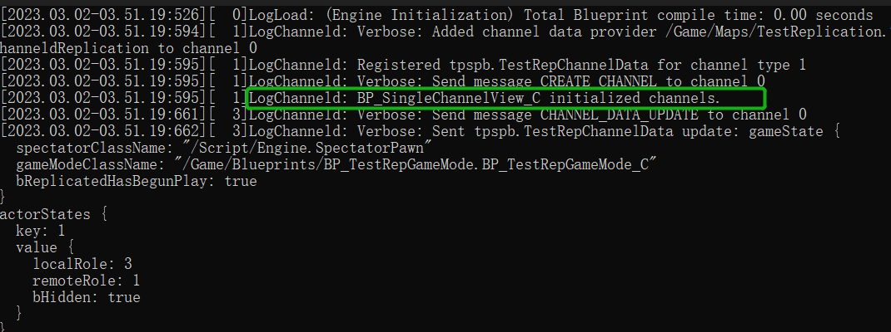

```
注意：如果UE服务器连接channeld失败，则会退出。
```

# 5.运行游戏并测试
## 5.1.测试单个客户端
确保在`运行Standalone`网络模式下运行游戏。此时客户端尚未连接到channeld，需要手动连接。在客户端的控制台中输入`connect 127.0.0.1`并回车。观察到客户端重新加载地图并创建角色，说明连接成功。

在地图中移动角色，并观察服务器的控制台中打印的日志，会出现对应的同步数据输出：

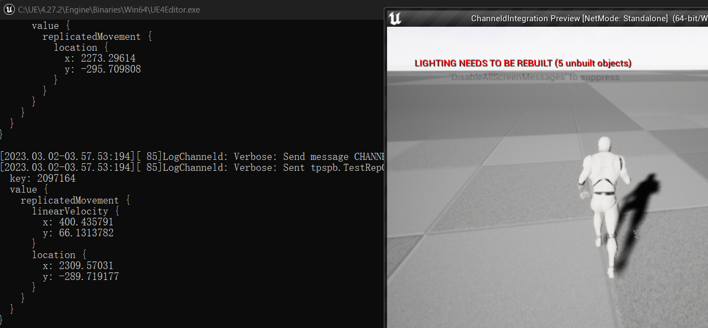

## 5.2.测试多个客户端
如果要同时开启多个客户端，需要对默认的编辑器设置做一些修改。打开主菜单`编辑 -> 编辑器偏好设置 -> 关卡编辑器 -> 播放`，在`Multiplayer options`中，**取消**`单进程下的运行`的勾选：

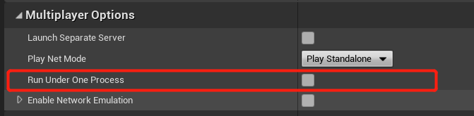

```
原理：在网络底层，ChanneldConnection类负责和channeld网关服务进行连接，并进行创建、订阅、退订频道等操作。
因为一个UE或UE编辑器进程只能存在一个ChanneldConnection对象，所以在单进程下，同时存在多个客户端或服务端会出现错误。
```

此时，增加玩家数量并运行游戏。第一个客户端窗口会立刻出现；其它客户端窗口会稍后出现，因为它们都是单独的UE进程，需要一些时间启动。

在每个客户端窗口中，打开控制台并输入`connect 127.0.0.1`。观察多个客户端之间的同步。

在入门教程中，客户端都需要通过这种方式手动连接。*频道数据视图*的章节中，将会介绍如何通过扩展视图，在蓝图中建立连接。

# 6.基本的开发工作流
## 6.1.创建有同步变量的Actor
新建一个Actor蓝图`BP_TestActor`，并为其添加同步组件`ChanneldReplicationComponent`。Actor默认不开启同步，需要在组件中手动勾选`Replicate`选项：

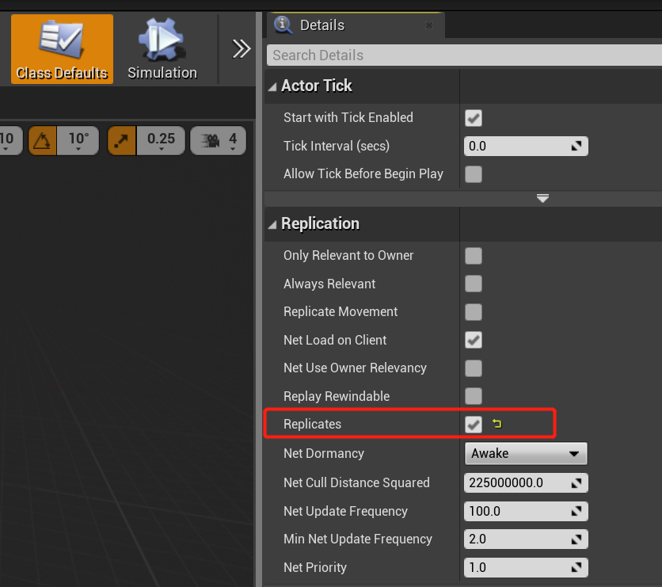

接下来，为该Actor添加一个`Cube`组件，使其可见。由于接下来要通过蓝图实现该Cube的位移和旋转，所以需要开启Cube组件的网络同步：

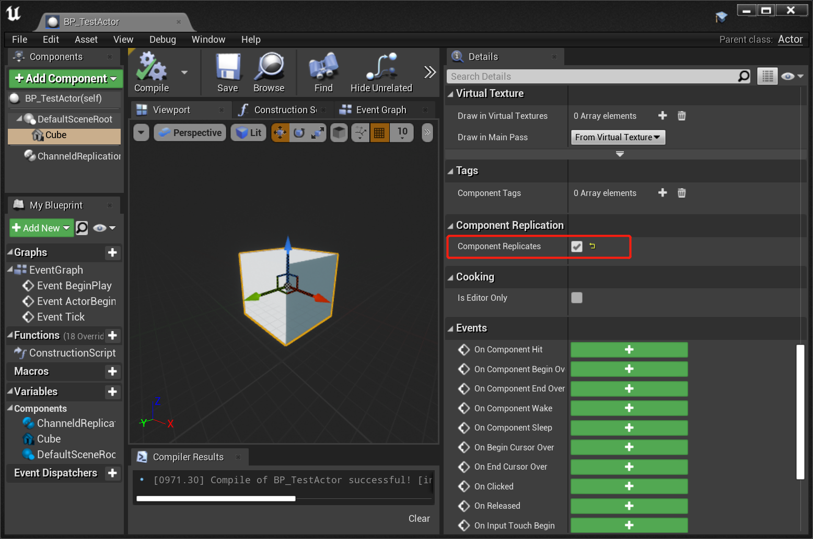

然后，为该Actor添加一个同步变量`Size`，类型为Float，设置Replication为`RepNotify`，开启同步及回调：

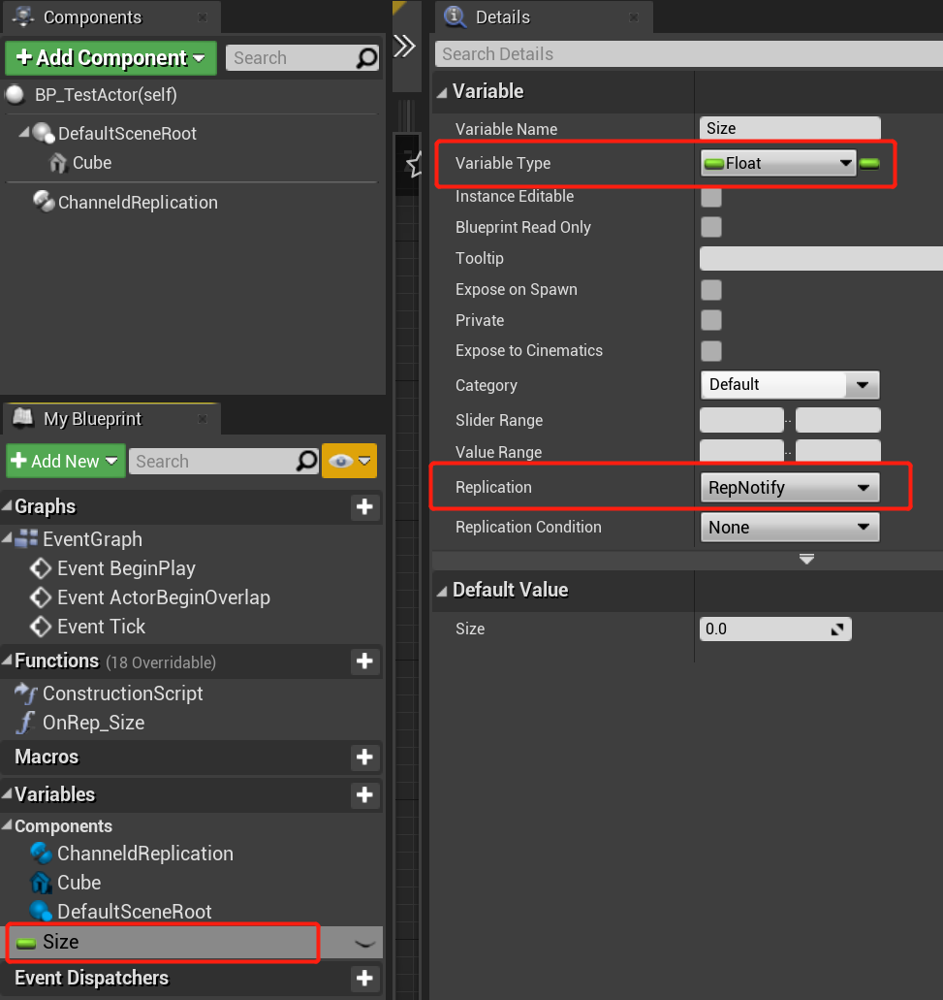

在Size的同步回调函数`On Rep Size`中，打印出同步的值：

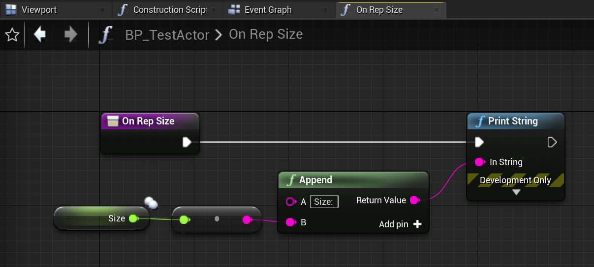

## 6.2.在蓝图中实现移动逻辑
在`BP_TestActor`的事件图表中，为Tick事件添加如下节点，使`Cube`组件可以随着时间上下移动和旋转：


```
注意：添加IsServer节点，确保只有服务端才会执行该逻辑。
```

## 6.3.在玩家控制器中实现创建Actor的逻辑
在`BP_ThirdPersonPlayerController`中，添加如下节点，使玩家按下`F`键时，在角色前方创建一个`BP_TestActor`，并为其设置一个随机的Size：

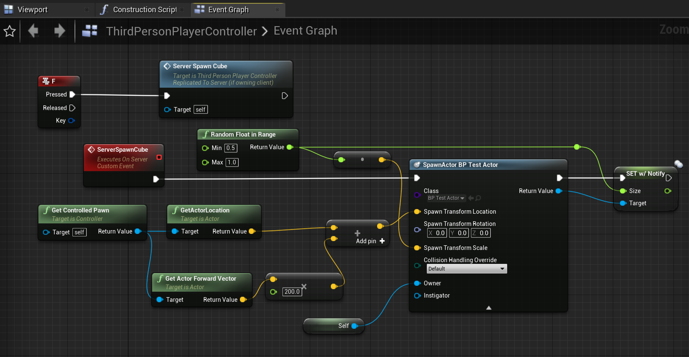

```
注意：ServerSpawnCube函数需要设置为“在服务器上运行”。这样创建出来的Actor才会出现在其它客户端。

另外，调用SpawnActor函数的参数中，需要设置Owner为当前控制器。这样的话，之后的跨服示例才能正常工作。
```

## 6.4.生成同步代码
因为我们在上面的步骤里添加了新的同步类和变量（`BP_TestActor`），以及为已有的同步类添加了RPC（`BP_ThirdPersonPlayerController`），所以需要添加同步相关代码。

在ChanneldUE中，已经内置了Actor，Character，PlayerController等常用类的同步代码，所以我们只需要为新添加的`BP_TestActor`和`BP_ThirdPersonPlayerController`生成同步代码。

首先，点击插件工具栏中的`Stop Servers`关闭之前开启的游戏服务器。然后，点击`Stop Channeld`关闭之前开启的channeld服务：

// TODO 截图

然后，点击`Generate Replication Code`选项，生成同步代码。首次生成时间要遍历项目中所有的代码和蓝图，所以可能较长，请耐心等待。

代码生成后，会自动编译。编译成功，则整个生成步骤完毕。下面可以进入游戏看看效果了。

```
注意：每次进行同步相关的修改后（包括：增删改名同步类，同步变量，或RPC），都需要重新生成同步代码。
```

## 6.5.启动服务器并测试
重复步骤4，启动channeld服务和游戏服务器。然后，重复步骤5，运行游戏并连接到服务器。

连接成功后，按下`F`键，可以看到在角色前方创建了一个`BP_TestActor`，并在屏幕左上方打印出`Size`的值：

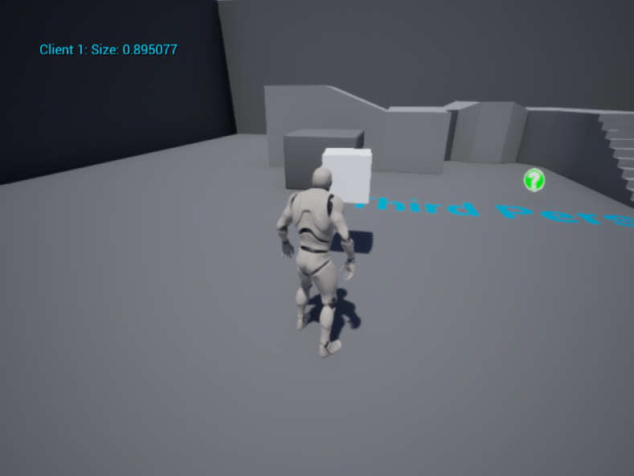

# 7.使用空间频道运行地图
## 7.1.空间频道简介
前面在配置频道数据视图时提到了频道的概念——频道是订阅和状态数据的集合。订阅是指哪些连接（包括客户端和服务端）关心该频道的状态数据更新；状态数据则是游戏中的需要同步的对象（比如Actor，Character，PlayerController等）的同步属性的集合。

开发者可以定义游戏中包含哪些频道，以及每种频道的状态数据的结构。常见的频道类型有：
- 全局频道：所有连接都订阅该频道。状态数据一般为所有玩家共享，如世界时间。
- 子世界频道：在空间上隔离的游戏世界，如MMO中的副本，或一局游戏的房间。每个子世界视频对应一个UE服务器进程。
- 空间频道：在空间上联通的游戏世界，适用于将较大的地图分割为多个区域。每个区域对应一个UE服务器进程。

空间频道相较于子世界频道，因为它在空间上是联通的，所以玩家在频道之间切换，不需要重新加载地图，也不需要重新连接到服务器。这样，可以大大减少玩家在切换频道时的等待时间，提升游戏体验。

空间频道有很多实现方式，从最简单的静态网格切分，到复杂的基于负载的动态切分。channeld内置提供了一种简单的静态网格切分的实现，开发者可以根据自己的需求，自行实现更复杂的切分方式。  

下面将介绍如何在UE中通过配置的方式使用空间频道。

## 7.2.在项目设置中配置空间频道
打开主菜单`编辑 -> 项目设置 -> 插件 -> Channeld`，将Channel Data View Class改为`SpatialChannelDataView`。该类会成为客户端使用的频道数据视图类。

为了让空间频道更直观地显示出来，在相同的设置界面中勾选`Spatial -> Debug -> Enable Spatial Visualizer`，开启ChannelUE内置的空间频道可视化工具：

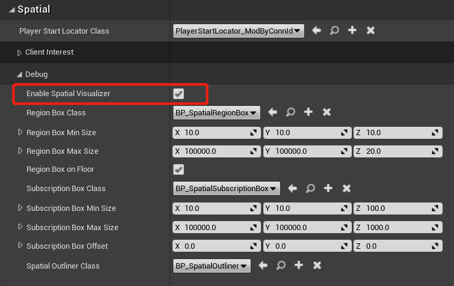


接下来，还需要配置服务端使用的频道数据视图类。

## 7.3.在编辑器设置中配置主服务器和空间服务器
在7.1.中介绍过，空间频道运行于空间服务器上，一个空间服务器可以对应一到多个空间频道。然而一个游戏世界背后的服务器往往不止有空间服务器，因为像玩家进入游戏后初始位置（即所属空间频道）的分配、全局的状态管理（如GameState）等逻辑，都需要一个跨越空间的服务器来处理，这个服务器在channeld中被称为**主服务器**。主服务器即全局频道的所有者。

打开主菜单`编辑 -> 编辑器偏好设置 -> 插件 -> Channeld Editor`。在`Server Groups`中，将第一服务器组的视图类(Server View Class)改为`SpatialChannelDataView`。

接下来，点击`Server Groups`右侧的加号，添加一个新的服务器组。将新的服务器组的视图类(Server View Class)改为`SpatialSpaceServerView`。将服务器数量(Server Num)改为2，表示有两个空间服务器。将启动延时(Delay Time)改为2.0秒，保证主服务器启动后，再启动空间服务器。设置好的服务器组如下图所示：


## 7.4.运行游戏并测试
重复步骤4，重启channeld服务和游戏服务器。可以观察到，3个UE服务器进程依次启动。其中2个空间服务器进程在启动成功后，会打印出创建空间频道成功的日志：

```log
LogChanneld: Created spatial channels: 65536,65537 （空间服务器1）
LogChanneld: Created spatial channels: 65538,65539 （空间服务器2）
```

重复步骤5，运行游戏并连接到服务器。进入场景后，可以观察到空间频道可视化工具带来的效果：
- 地板上会显示不同颜色的色块和网格。一种颜色表示同一个空间服务器；每个网格表示一个空间频道。
- 空气中会填充不同的半透明颜色，表示客户端所订阅的空间频道，即兴趣范围。**客户端接收不到兴趣范围之外的同步**。
- 玩家角色的身上会出现亮边，颜色对应该角色所属的空间服务器。

// TODO: 截图


在场景中移动，跨过地板上的网格。可以观察到：跨过同一颜色的网格，兴趣范围也会随着移动；角色的亮边颜色不会改变，因为并没有发生跨服；而跨过不同颜色的网格，角色的亮边会改变为所在空间服务器的颜色，因为发生了跨服。

# 8.总结
以上是ChanneldUE的基本功能展示。如果您想要深入理解channeld的概念，可以浏览[基本概念](../concepts.md)章节；如果您想要动手尝试更多的功能，比如：
- 配置更多空间服务来运行更多的空间频道
- 控制客户端接收的同步范围
- 让GameState在多个空间服务器上同步属性

可以浏览后面的进阶主题；也可以下载[ChanneldUE示例项目](https://github.com/channeld/channeld-ue-demos)。

# 9.故障排查
## Setup脚本没有下载channeld
如果您在运行Setup前，已经配置了环境变量`%CHANNELD_PATH%`，Setup脚本会认为您已经安装了channeld，并跳过下载安装步骤。插件会根据环境变量%CHANNELD_PATH%来运行channeld。

如果您需要下载安装channeld到插件目录中，请先删除环境变量%CHANNELD_PATH%。

## 无法启动channeld服务
- 检查任务管理器中是否存在channeld进程，如果存在，请手动“结束任务”
- 如果输出日志中出现`failed to listen`的错误，说明端口被占用。请检查默认的端口12108和11288是否被其它程序占用，或者在channeld配置文件中修改端口号

## 游戏服务器启动后自动退出
- 检查channeld服务是否正常运行。在开启了channeld网络（`Enable Channeld Networking`）时，游戏服务器会尝试连接channeld服务。如果连接失败，游戏服务器会自动退出
- 检查游戏服务器的日志。日志文件通常位于项目目录下的`Saved/Logs`目录中，以项目名_{数字}命名。在单服模式下，数字为2是游戏服务器日志；在多服模式下，数字为2是主服务器日志，数字从3开始是空间服务器日志

## 无法保存蓝图
如果出现“无法保存资产”的错误提示，通常是由于游戏服务器仍在运行，导致蓝图文件被占用。请先关闭游戏服务器，再保存蓝图。

## 项目中存在其它Protobuf库的冲突
ChanneldUE插件使用了Protobuf库，并以ProtobufUE模块的方式进行引用。如果您的项目中也使用了Protobuf库，则需要将ChanneldUE插件或项目对ProtobufUE模块的引用改为您自己的模块，并重新编译。注意ChannelUE引用Protobuf使用的路径是`google/protobuf/*.h`，如果您使用的Protobuf库的根路径不同，会导致ChanneldUE插件编译错误。
