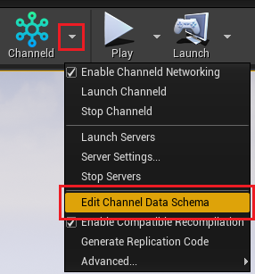
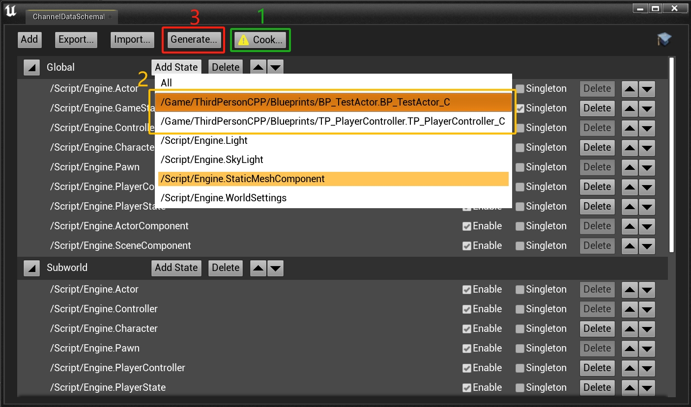

# 6. Add Replicated Actor
[The previous chapter](third-person-template.md) introduced how to run the project using ChanneldUE's network framework. This chapter will demonstrate the similar workflow as the native UE of adding a replicated Actor.

## 6.1. Create an Actor with replicated variables
Create an Actor Blueprint `BP_TestActor` and add a replication component `ChanneldReplicationComponent` to it. The Actor is not replicated by default, so you need to manually check the `Replicates` option in the component:

Next, add a `Cube` component to the Actor to make it visible. Since we will move and rotate of the Cube in the Blueprint running on server, we need to enable the network replication for the Cube component:

Then, add a replicated variable `Size` to the Actor, the type is `Float`, set Replication to `RepNotify`, and enable replication and callback:

In the callback function `On Rep Size`, print out the value of the replication:

## 6.2. Implement the movement logic in the Blueprint
In the event graph of `BP_TestActor`, add the following nodes to the Tick event, so that the `Cube` component can move up and down and rotate with time:

>Note: Add the `IsServer` node to ensure that the logic is only executed on the server.

## 6.3. Implement the logic of creating Actor in the Player Controller
In `ThirdPersonPlayerController`, add the following nodes, so that when the player presses the `F` key, a `BP_TestActor` is created in front of the character, and a random Size is set for it:

>Note: The ServerSpawnCube function needs to be set to "Run on Server". So that the created Actor will appear on other clients.
>
>In addition, the Owner input of the SpawnActor node needs to be set to the current controller, so that the cross-server example can work properly later.

## 6.4. Configure the Channel Data Schema and generate the replication code
Because we added new replicated classes and variables (`BP_TestActor`), and added RPCs (`ThirdPersonPlayerController`) to existing replicated classes, we need to generate the replication code.

The replication code for commonly used classes such as Actor, Character and PlayerController has been built in ChanneldUE, so we only need to generate the replication code for the newly added `BP_TestActor` and `ThirdPersonPlayerController`.

First, click the `Stop Servers` button in the plugin toolbar to close the previously launched game server. Then, click `Stop Channeld` to close the channeld service as well:

Then, click the `Editor Channel Data Schema...` button in the plugin toolbar to open the Channel Data Schema editor:

In the Channel Data Schema editor, do the following:

1. Click the `Refresh...` button and wait for the refresh of the channel data states to complete. The first refresh may take a while to traverse all the code and Blueprints in the project, so please be patient.
2. Find the `Global` channel, click the `Add State` button, and then click the reference(state) of `ThirdPersonPlayerController` and `BP_TestActor` in the expanded menu.
3. Hit the `Generate...` button and wait for the code generation to complete.

Finally, after the code is generated, it will be compiled automatically. If the compilation is successful, the entire generation process is complete. Now you can enter the game to see the change.

>Note:
>1. Please make sure that the Live Coding in the UE editor preferences is turned off before generating the replication code, otherwise errors may occur when restarting the game server;
>2. After each modification related to replication (including: adding, deleting or renaming replicated classes, replicated variables, or RPCs), you need to regenerate the replication code;
>3. After adding a new replicated Actor, you need to add its reference(state) to the corresponding Channel Data Schema before it can be replicated normally.

## 6.5. Start the server and test
Repeat step 4 to start the channeld service and game server. Then repeat step 5 to run the game and connect to the server.

After the connection is successful, press the `F` key, you can see that a `BP_TestActor` is created in front of the character, and the value of `Size` is printed in the upper left corner of the screen:

## Next Step
In the following chapter, we will introduce how to seamlessly run the a map on multiple UE servers. [Click here](use-spatial-channel.md) to continue.

[Back to the Document Home](README.md)
