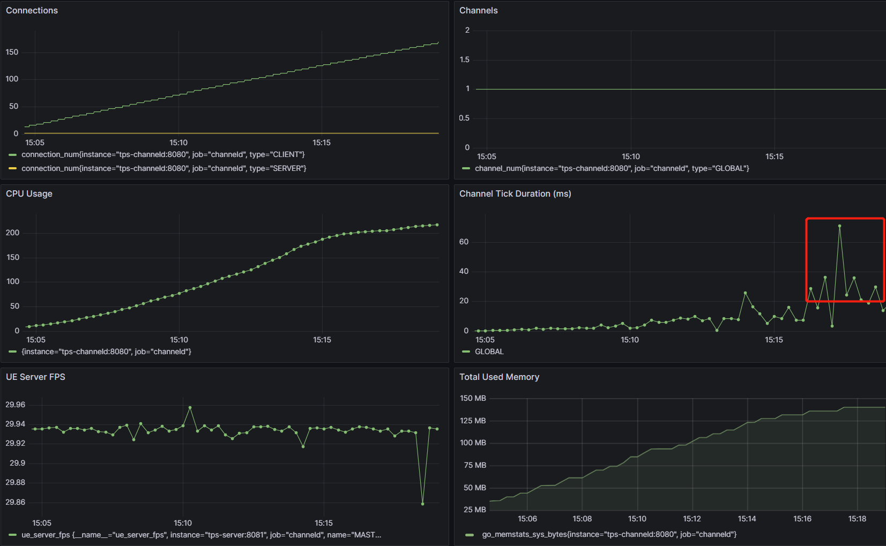
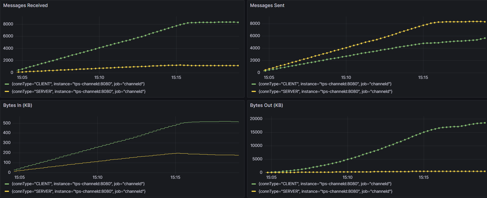
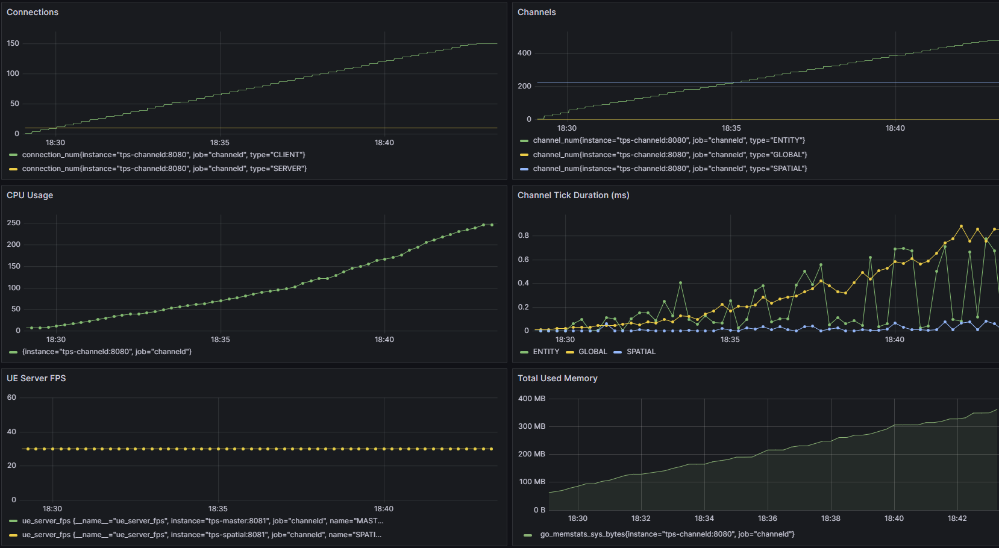
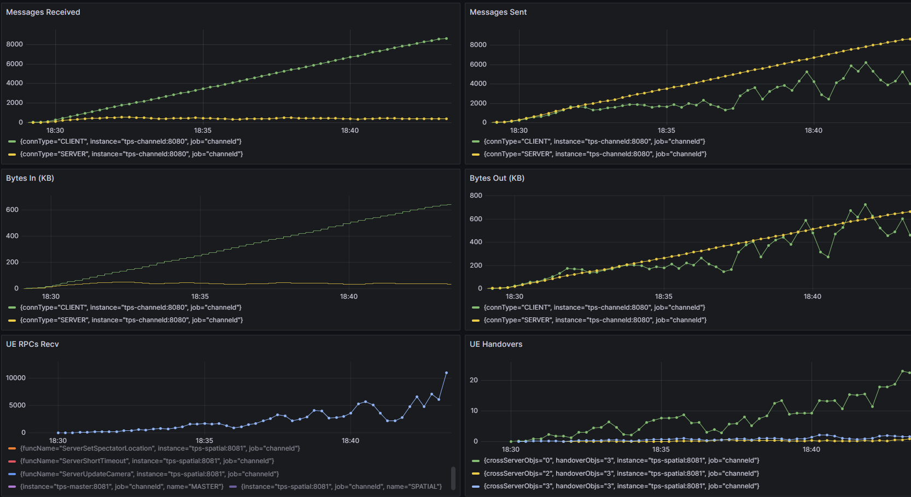

# Preparation
## Test machines:
All machines are ECS instances from the public cloud providers.

channeld + UE server: c5.4xlarge32 (16 vCPU cores, 32GB memory), 1 instance

UE simulated client: u1-c1m4.8xlarge (32 vCPU cores, 128GB memory), 1 instance

## System:
Both client and server are running on Linux distributions + Docker. The client and server are connected via a private network with a speed of 10Gbps or above.

Hardware resource limits for each service:
- channeld: 8 vCPU cores, 1GB memory
- UE server: 1 vCPU core, 1GB memory
- UE simulated client: 0.2 vCPU core, 0.5GB memory

## channeld settings:
1. Use the HiFi channel preset (channel tick and fan-out frequency: 50Hz)
2. dev mode
3. Log level: Info

## UE server settings:
1. UE 4.27.2, Development Server
2. Enable ChanneldUE networking
3. Fixed frame rate: 30
4. The default CharacterMovementComponent is used for the character
5. Enable collision detection

## Simulated client behavior:
1. Move forward continuously
2. There is a 10% chance of turning left or right every second
3. There is a 10% chance of jumping every second
4. Turn around when hitting an obstacle
5. To reduce the CPU consumption of the simulated client, the Tick of the Simulated Proxy Actor and its components is disabled (equivalent to not updating the position of other clients)

## Sampled metrics:
- Number of channeld connections (client + server)
- Number of channels
- channeld CPU usage
- channeld memory usage
- Tick time of channels
- UE server frame rate
- Number of messages sent and received by channeld per second
- channeld upstream and downstream traffic per second
- Frequency of spatial channel handover

# Scenario 1: Single UE Server
### Test map:
TestReplication

### Channel data view class:
SingleChannelDataView

### Services:
- channeld x 1
- UE Server x 1
- UE Client x 150

## Grafana dashboard:

## Analysis:
1. Within 100 client connections, the CPU usage of channeld is basically linear with the number of connections
2. At around 130 CCU, the processing capacity of a single channel reaches its bottleneck, and the update frequency of 50Hz can no longer be maintained
3. The frame rate of the UE server has been stable at 29-30FPS, and is not affected by the number of online players
4. channeld's memory pressure is also very small, and the memory usage per connection is less than 1MB
5. After reaching the bottleneck, the system's IO throughput also stops climbing

# Scenario 2: Multiple UE Spatial Servers
### Test map:
TestSpatial_Benchmark

### Channel data view class:
SpatialChannelDataView

### channeld spatial channel settings:
- 3x3 spatial servers
- 15x15 spatial channels
- Each spatial channel is 20x20 meters in size
- No server interest border

### Client interest settings:
- A spherical area with a radius of 30 meters
- Disable auto-follow (i.e. only update the interest area when handover)

## Grafana dashboard:

## Analysis:
1. After using spatial channels, the average CPU usage of each client connection has increased
2. However, the CPU consumption is distributed from the global channel to the spatial channel and entity channel, so the maximum Tick time of all channels is only 0.8ms at around 130 CCU
3. Although hundreds of spatial channels + entity channels are created, the memory usage of channeld is still less than 500MB
4. Since the client no longer receives data updates from all other clients through spatial interest management, the number of messages sent and received per second drops to less than 1/10 of that of a single channel
5. The unit of `UE Handovers` is the number of spatial channel handovers per second. Since each client is moving continuously, and the size of the spatial channel is only 20x20 meters, the handover frequency is much higher than that in actual games

## TODO:
1. Solve the problem that RPC forwarding after cross-server handover has a probability of failure in the current version
2. Add more ECS instances to run simulated clients
