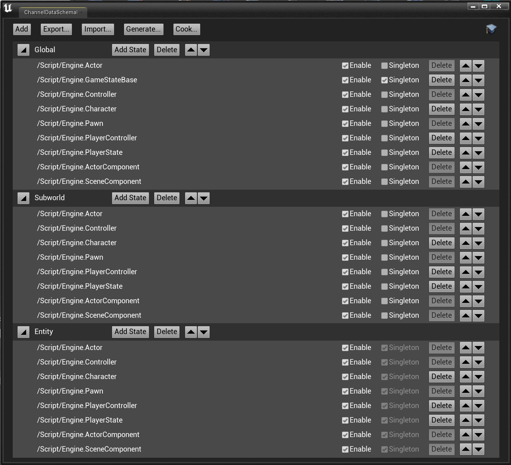
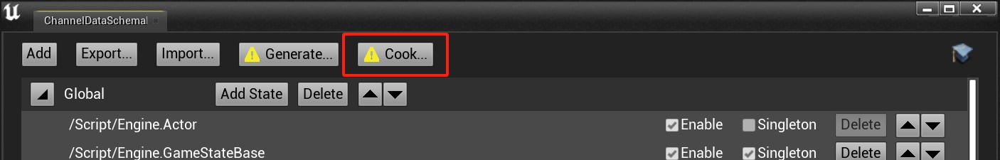
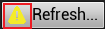
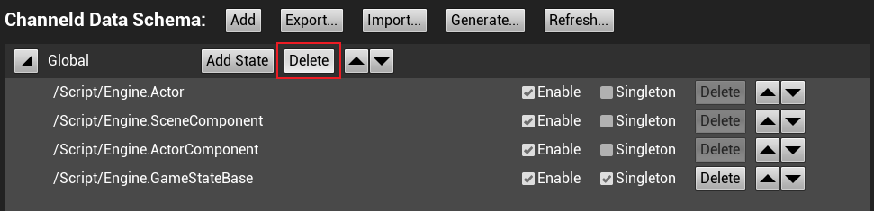
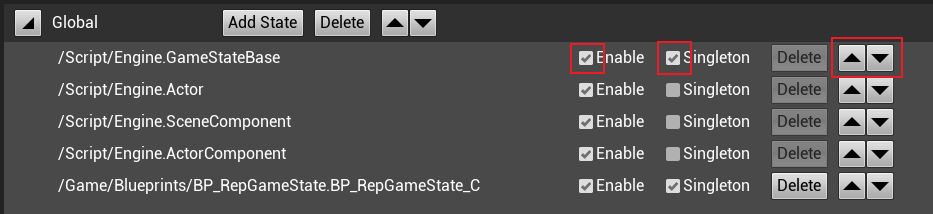
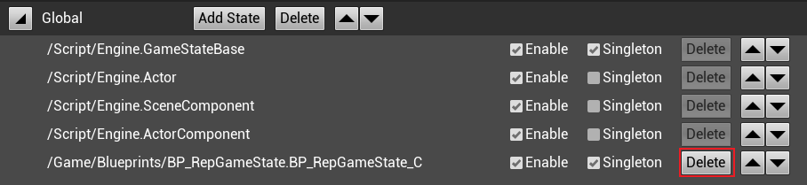
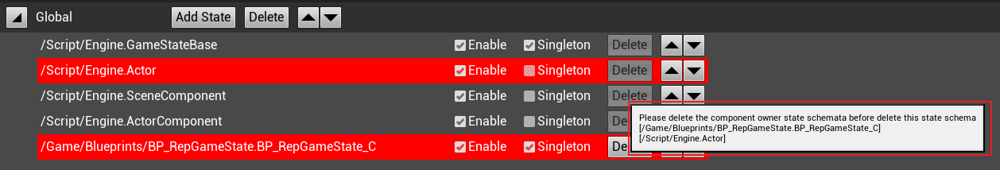

# Channel Data Schema
## What is it
Channel Data Schema defines a channel's [channel data state](./basic-concepts.md#state-in-channel-data) corresponding to the [channel](./basic-concepts.md#channel). 
>GameState, WorldSetting and other replicated Actors only exist one instance in a virtual world, so they should be singleton in the Channel Data Schema.

## Channel Data Schema Editor
Channel Data Schema is defined in JSON format, but it is not recommended to modify the json file directly, but to use the built-in tool of ChanneldUE to edit it.
>The definition file of Channel Data Schema is stored in: `Config/ChanneldChannelDataSchema.json` under the project root directory.
>
>The default definition file of Channel Data Schema is stored in: `Config/DefaultChannelDataSchema.json` under the ChanneldUE plugin root directory.

### Open the editor
As shown in the figure below, click the `Editor Channel Data Schema...` button of the ChannelUE plugin to open the Channel Data Schema editor.

The opened editor is shown in the figure below:

>When opening the Channel Data Schema editor for the first time in a new project, the default Channel Data Schema will be automatically created.

### Save the Channel Data Schema
The Channel Data Schema editor will be automatically saved. When the Channel Data Schema is modified, the Channel Data Schema will be automatically saved to the `Config/ChanneldChannelDataSchema.json` file under the project root directory.

### Update the replication cache
When a replicated Actor or ActorComponent is added or deleted in the project, the replication cache needs to be updated so that the editor can correctly display the available channel data states.

As shown in the figure below, click the `Refresh...` button above the Channel Data Schema editor to update the replication cache.

>When the replication cache has not ever been updated, or any asset in the project has changed, there will be a warning icon on the left of the  button to indicate that the replication cache needs to be updated. But you can decide whether to update the replication cache according to your needs.

Wait for a while, when the UE editor prompts `Successfully Updated Replication Actor Cache` in the lower right corner, it means that the update is successful.

After the update is completed, you can add channel data states to the Channel Data Schema.

### Add a channel data type
As shown in the figure below, click the `Add` button above the Channel Data Schema editor, and select the channel data type that needs to be added in the submenu to add the channel data type.

### Delete a channel data type
As shown in the figure below, click the `Delete` button of the channel data type that needs to be deleted to delete the channel data type.

### Add a channel data state
When a replicated Actor or ActorComponent is added in the project, and you want it to be replicated in a channel, you need to add a channel data state to the Channel Data Schema.

As shown in the figure below, click the `Add State` button of the channel data type that needs to add a channel data state, and select the channel data state that needs to be added in the submenu to add the channel data state.

>When selecting the channel data state to be added, its (with replication property) parent class and used (with replication property) component will be highlighted. When adding the channel data state, its (with replication property) parent class and used (with replication property) component will be automatically added.

### Configure the channel data state
As shown in the figure below, the channel data state can be configured with three properties:

* Enable: Whether to enable the channel data state in the channel data.
* Singleton: Whether the channel data state has only one instance in the channel. The channel data state of the entity channel is generally singleton.
* Order: The order of the channel data state.

### Delete a channel data state
As shown in the figure below, click the `Delete` button of the channel data state that needs to be deleted to delete the channel data state.

>Before deleting a state, you need to delete the states that depend on it, such as the states of subclasses or components.
>* The following figure shows that you want to delete the channel data state of GameStateBase, but since the channel data state of BP_RepGameState, a subclass of GameStateBase, is the Channel Data Schema, you need to delete BP_RepGameState before deleting GameStateBase.
>
>
>
>* The following figure shows that you want to delete the channel data state of SceneComponent, but since BP_RepGameState and Actor both use the SceneComponent component, you need to delete BP_RepGameState and Actor before deleting SceneComponent.
>
>

### Import and export Channel Data Schema
* Import Channel Data Schema
Click the `Import...` button above the Channel Data Schema editor, select the Channel Data Schema json file to be imported, and click the `Open` button to import the Channel Data Schema.

* Export Channel Data Schema
Click the `Export...` button above the Channel Data Schema editor, select the Channel Data Schema json file to be exported, and click the `Save` button to export the Channel Data Schema.
