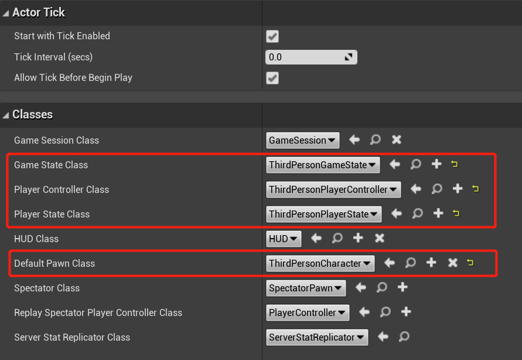
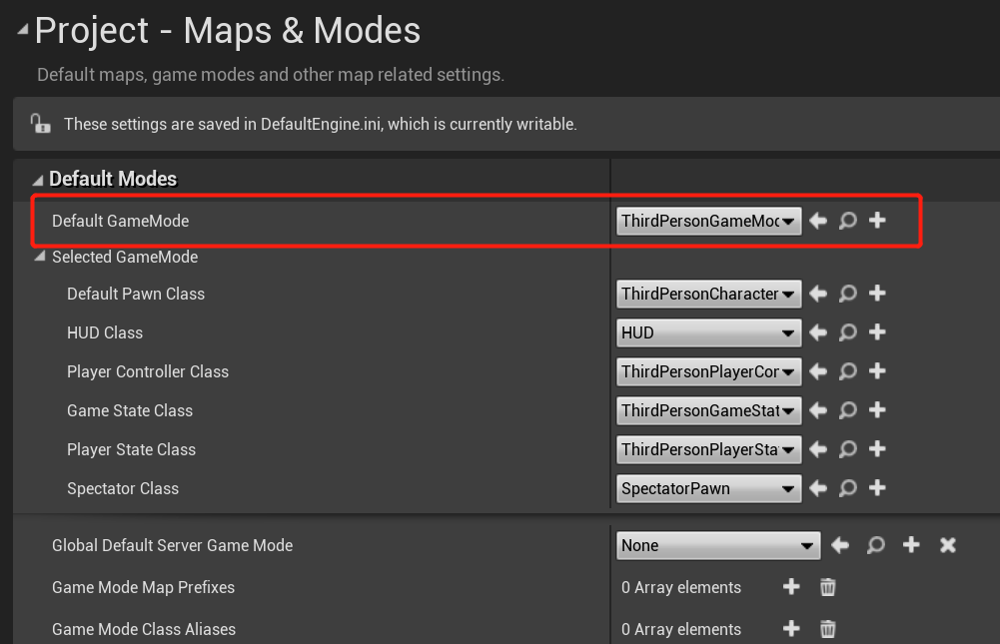
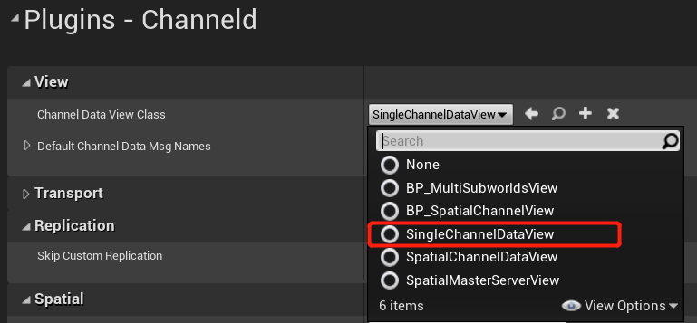
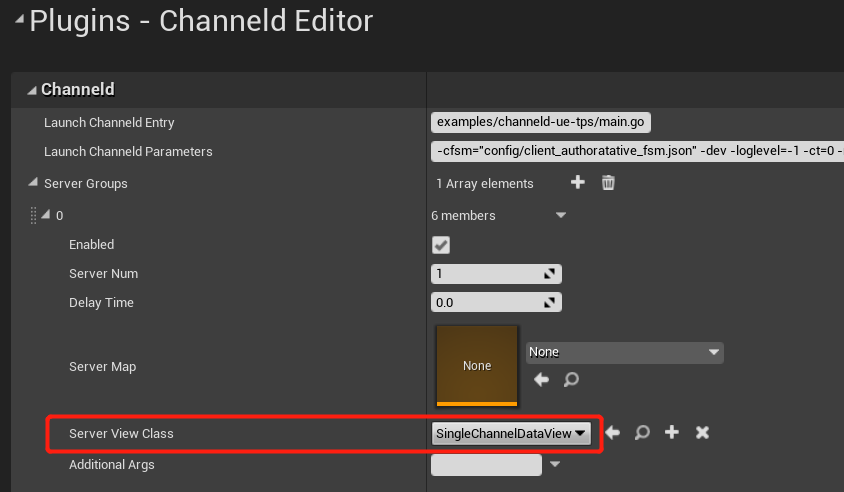
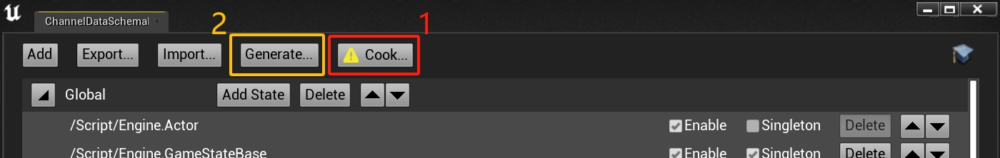
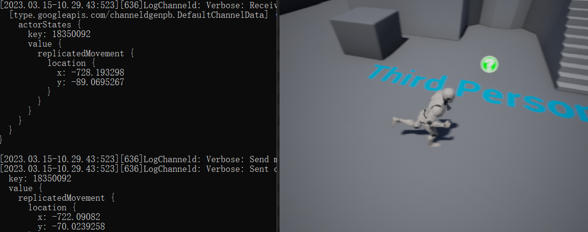

# Run the Third Person Template Project
[Previous Chapter](installation.md) introduced how to install and enable the ChanneldUE plugin for the project. After enabling the plugin, the game will still use the UE's native network framework. This chapter will introduce how to run the project on ChanneldUE's network framework.

## 2.3.Create base replication classes and Game Mode for the project
Because the Gameplay framework used by the project by default does not support channeld-based network replication, a batch of Blueprint classes with added synchronization components need to be created.

##### 2.3.1.Add the replication component to the third-person character Blueprint
Open the Blueprint `ThirdPersonCharacter` of the third-person character and add the replication component `ChanneldReplicationComponent` to it:


##### 2.3.2.Create `PlayerController`, `GameState` and `PlayerState` Blueprints
Respectively create three Blueprints that inherits from `PlayerController`, `ChanneldGameState` and `PlayerState`, and name them `ThirdPersonPlayerController`, `ThirdPersonGameState` and `ThirdPersonPlayerState`:


>Tip: You can use either `GameStateBase` or `ChanneldGameState` as the base class. If the cross-server replication will be used via GameState in the later development, you sholud use `ChanneldGameState`.

##### 2.3.3.Enable replication for the newly created Blueprints
Follow the steps in 2.3.1. to enable `Replicates` and add the replication component `ChanneldReplicationComponent` to the newly created three Blueprints.

>Tip: Remember to compile and save the above Blueprints after enabling Relicates and adding the replication component!

 ##### 2.3.4.Create the `GameMode` Blueprint
Create a new GameMode Blueprint `ThirdPersonGameMode` (if it already exists, open it), and set `Game State Class`, `Player Controller Class`, `Player State Class` and `Default Pawn Class` to `ThirdPersonGameState`, `ThirdPersonPlayerController`, `ThirdPersonPlayerState` and `ThirdPersonCharacter` respectively:



>Tip: You can use either `GameModeBase` or `ChanneldGameMode` as the base class. If the spatial channel will be used in the later development, you should use `ChanneldGameMode`.

##### 2.3.5.Apply the GameMode Blueprint
Set `ThirdPersonGameMode` as the default Game Mode in the project settings



>Tip: In UE5, you also need to set "Game Mode Override" in the World Settings to `ThirdPersonGameMode`.

# 3.Configure the plugin
## 3.1.Configure the Channel Data View
The Channel Data View is one of the core concepts of the ChanneldUE plugin. It is mainly used to associate the replicated objects (Characters, Controllers, Game State, etc.) with the channel data. There is one view object for each the UE client and the server.
Next, open the `Project Settings -> Plugins -> Channeld`. We need to set a default view for the project:



`SingleChannelDataView` is a built-in view class in the plugin. It will create the **Global Channel** on the server and subscribe the client to the channel after the it connects successfully. After the subscription, the network data sent by the client will be forwarded to the owner of the global channel, that is, the server that created the channel, through channeld.

## 3.2.Configure the server group
As an extension focuses on the distributed simulation with UE, the ChanneldUE plugin supports running multiple UE servers at the same time, and each server can configure its own view and launch parameters.

To add a server group, open the `Editor Preferences -> Plugins -> Channeld Editor`. Click the plus button in the `Server Groups` section and expand the settings:



Make sure that `Enabled` is checked, `Server Num` is 1, and `Server View Class` is also set to `SingleChannelDataView`. If `Server Map` is left blank, the currently opened map in the editor will be used when the server is started.

# 4.Start the channeld service and game server
Before you start the channeld service and game server for the first time, you need to generate the replication code. Open the drop-down menu of the ChanneldUE plugin in the toolbar, click the `Edit Channel Data Schema...` to open the Channel Data Schema editor. Click the `Generate...` button to start generating the replication code. It may take a long time for the first generation, as it will traverse all the code and Blueprints in the project, so please be patient.



>Note: The Live Coding feature which enabled by default in UE5 may cause the link error or the server to fail to start. If you encounter this problem, you need to disable the Live Coding feature and regenerate the code, or close the UE editor and then recompile and launch the project.

After the code generation is successful, open the drop-down menu of the ChanneldUE plugin in the toolbar, and make sure that `Enable Channeld Networking` is checked:


Then, click `Launch Channeld` to start the channeld service (as shown in the figure above marked 2). If the Windows Firewall prompt pops up, please allow channeld to pass through the firewall.

Finally, click `Launch Servers` to start the game server (as shown in the figure above marked 3). At this time, each command line window corresponds to a UE server process. A normal-started UE server will print similar information in the console:


>Note: If the UE server fails to connect to channeld, it will exit.

# 5.Run the game and test
## 5.1.Test a single client
Make sure to run the game in `Standalone` network mode. By default, the client has not connected to channeld and needs to be connected manually. Enter `open 127.0.0.1` in the client's console and press Enter. Observe that the client reloads the map and creates the player character, indicating that the connection is successful.

Move the character in the map and observe the log printed in the server's console. The corresponding replication data will be output:



## 5.2.Test multiple clients
If you want to open multiple clients at the same time, you need to make some changes to the default editor settings. Open the `Editor Preferences -> Level Editor -> Play`, in `Multiplayer Options`, **uncheck** `Run Under One Process`:


```
Why: In the transport layer, ChanneldConnection class is responsible for connecting to the channeld gateway service and performing operations such as creating, subscribing, and unsubscribing channels.
There's only one ChanneldConnection instance for an UE process, including the Editor process, and it can not be shared between the PIE clients.
```

Now increase the number of players and run the game. The first client window will appear immediately; the other client windows will appear later, because they are separate UE processes and need some time to load.

In each client window, open the console and enter `open 127.0.0.1`. Observe the synchronization between multiple clients.

>Tip: In the following chapters, we will introduce how to establish connections to channeld in Blueprints.

## Next Step
In the following chapter, we will introduce how to add new replicated Actors to the ChanneldUE's network framework. [Click here](add-replication.md) to continue.

[Back to the document home page](README.md)
