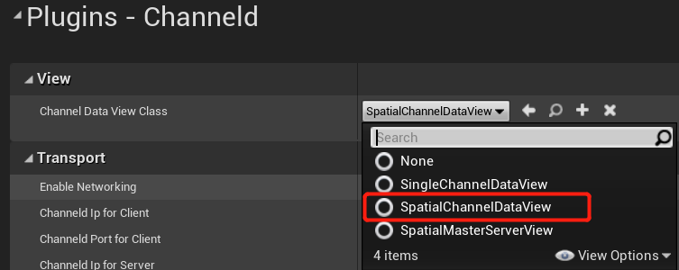
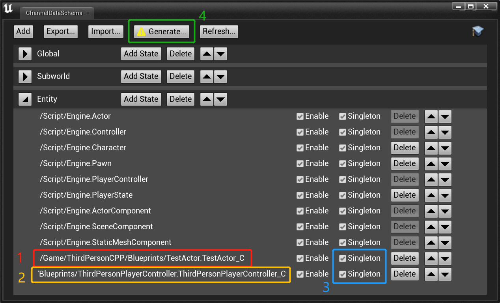

# 7.Use Spatial Channel
[Previous chapter](add-replication.md) introduced the basic workflow of networked gameplay development using ChanneldUE. This chapter will introduce how to split the third-person map into two UE servers to run.

## 7.1.Spatial Channel Introduction
In the previous chapter, we mentioned the concept of channel when configuring the Channel Data View. A channel is a collection of subscriptions and state data. Subscription refers to which connections (including clients and servers) care about the state data updates of the channel; state data is a collection of replicated properties of a object (such as Actor, Character and PlayerController) in the game.

Developers can define which channels are needed in the game, and the structure of the state data of each channel. Common types of channels include:
- Global channel: All connections subscribe to this channel. The state data is generally shared by all players, such as the world time.
- Subworld channel: A game world that is isolated in space, such as an instance in an MMO, or a matchmaking session. Each subworld corresponds to a UE server process.
- Spatial channel: A game world that is interlinked in space, suitable for dividing a larger map into multiple regions. Each region corresponds to a UE server process.

Contrast to the subworld channel, the spatial channel is spatially continuous, so players do not need to reload the map or reconnect to the server when switching between channels. This can greatly reduce the waiting time for players when travelling around the world and improve the game experience.

There are many ways to implement spatial channels, from the simplest static grid division to the more complex load-based dynamic division. ChanneldUE provides a simple static grid implementation, and developers can implement more complex division methods according to their own needs.

The following will introduce how to use spatial channels in UE through configuration. In the example, 4 spatial channels will be used, each channel is 2000x2000 in size; each 2 spatial channels will run on one UE server (called "Spatial Server"), so there are 2 spatial servers in total. This spatial channel configuration is built into channeld and is the default configuration of ChanneldUE.

## 7.2.Configure the Spatial Channel in the Project Settings
Open the `Project Settings -> Plugins -> Channeld`, and change the Channel Data View Class to `SpatialChannelDataView`. This class will become the Channel Data View class used by the client:



In order to visualize the spatial channels, check `Spatial -> Debug -> Enable Spatial Visualizer` in the same settings page to enable the built-in visualization tool of ChannelUE:


The spatial channel visualization tool can add different colors of outline to the character to distinguish the spatial channel where the character is located. To enable the outline function, you need to set `Custom Depth - Stencil Pass` to `Enabled with Stencil` in the `Project Settings -> Engine -> Rendering -> Postprocessing`:


Next, you also need to configure the Channel Data View class used by the server.

## 7.3.Configure the Master Server and Spatial Server in the Editor Settings
In 7.1, we mentioned that the spatial channel runs on the spatial server, and one spatial server owns one or more spatial channels. However, there are often more than just spatial servers behind a game world, because the logic such as the placing the player in the right position(and spatial channel) when entering the game, and the global state management (such as GameState), all need a non-spatial server to process. This server is called the **Master Server** in channeld. The master server is the owner of the Global channel.

Open the `Editor Preferences -> Plugins -> Channeld Editor`. In `Server Groups`, change the Server View Class of the first server group to `SpatialMasterServerView`.

Next, click the plus button on the right of `Server Groups` to add a new server group. Change the Server View Class of the new server group to `SpatialChannelDataView`. Change the Server Num to 2, which means there are two spatial servers. Change the Delay Time to 2.0 seconds to ensure that the spatial servers are started after the master server is started. The configured server group is shown in the figure below:


## 7.4.Modify the blueprint classes
### 7.4.1.Player Controller Blueprint
In step 5, we introduced the method of connecting to channeld by entering `open 127.0.0.1` in the console. This method is no longer applicable in the spatial channel scenario. The following is an example of connecting to channeld through Blueprint:

Open the `ThirdPersonPlayerController` Blueprint, first add a `Get ChanneldGameInstanceSubsystem` node. Then add the following nodes in the `BeginPlay` event:


### 7.4.2.Character Blueprint
Change the base class of `ThirdPersonCharacter` from `ACharacter` to `AChanneldCharacter` to support cross-server movement and RPC.

### 7.4.3.GameMode Blueprint
Change the base class of `ThirdPersonGameMode` from `AGameModeBase` to `AChanneldGameMode` to solve the problem of the player character entering the spatial server.

## 7.5.Configure the Channel Data Schema
Click the `Editor Channel Data Schema...` button in the plugin toolbar to open the Channel Data Schema editor:


In the Channel Data Schema editor, do the following:



1. Find the `Entity` channel, click the `Add State` button, and add `BP_TestActor`
2. In the `Entity` channel, click the `Add State` button again, and add `ThirdPersonPlayerController`
3. Make sure that the `Singleton` of `BP_TestActor` and `ThirdPersonPlayerController` added earlier are checked
4. Click the `Generate...` button and wait for the code generation to complete

## 7.6.Run the game and test
Repeat step 4 to start the channeld service and game server. Observe that 3 UE server processes are started in turn. After 2 spatial server processes are started successfully, the log of creating spatial channels will be printed:

```log
LogChanneld: Created spatial channels: 65536,65537 (Spatial Server 1)
LogChanneld: Created spatial channels: 65538,65539 (Spatial Server 2)
```

Hit the Play button, the client will automatically connect to channeld and enter the game server. The spatial channel visualization tool should also works as:
- Different colors of blocks and grids will be displayed on the floor. One color represents one spatial server; each grid represents a spatial channel.
- Different translucent colors will be filled in the air, representing the spatial channels that the client subscribes to, that is, the interest area. **The client will not receive any spatial update outside the interest area**.
- A bright outline will appear on the player character, and the color corresponds to the spatial server to which the character belongs.


Move the character in the map and move cross the grid on the floor. You should see that: when crossing the grid of the same color, the interest area will also move with the character; the color of the outline of the character will not change, because there is no cross-server; when crossing the grid of different colors, the color of the outline of the character will change to the color of the spatial server where the character is located, because cross-server occurs.

## 7.7.Adjustment for the third-person template map in UE5
Unlike the third-person template in UE4, the center point of the map in UE5 is not at the origin of the world coordinate system. So after starting according to the above steps, you will find that only one spatial channel falls in the map. To solve this problem, there are two ways:
1. Move the center point of the map to a position close to the origin of the world coordinate system, and then restart the game server.
2. Modify the spatial channel settings of channeld. The default configuration file is located in `%CHANNELD_PATH%/config/spatial_static_2x2.json`. Change `WorldOffsetX` and `WorldOffsetY` to 0, and then restart channeld and the game server.

# 8.Summary
Congratulations! So far, you have learned the basic functions of ChanneldUE. If you want to understand the concept of channeld in depth, you can browse the [Basic Concepts](basic-concepts.md) chapter; if you want to try more functions, such as:
- Configure more spatial servers to run more spatial channels
- Control the range of spatila update received by the client
- Use GameState to replicate properties across multiple spatial servers

You can continue to browse the [documentation](README.md); or you can download the [ChanneldUE demo project](https://github.com/metaworking/channeld-ue-demos).
