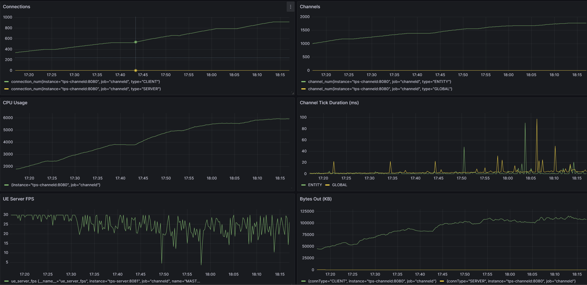

# 前言
本文档旨在介绍ChanneldUE的性能测试方法和结果。每次channeld或ChanneldUE进行了大幅性能优化后，都会重新进行测试，并更新此文档。

# 准备工作
## 测试用机型：
所有机型均使用公有云的ECS实例。

channeld + UE服务器：c5.4xlarge32（16核vCPU，32GB内存），共1台

UE模拟客户端：u1-c1m4.8xlarge（32核vCPU，128GB内存），共1台

## 系统：
客户端和服务端均在Linux发行版 + Docker上运行。客户端和服务器通过内网连接，速率在10Gbps以上。

每个服务的硬件资源限制：
- channeld：8核vCPU，1GB内存
- UE服务器：1核vCPU，1GB内存
- UE模拟客户端：0.2核vCPU，0.5GB内存

## channeld设置：
1. 使用HiFi频道预设（频道Tick和扇出频率50Hz）
2. dev模式
3. 日志等级为Info

## UE服务器设置：
1. UE 4.27.2，Development Server
2. 开启channeld网络同步
3. 固定帧率30
4. 角色使用默认的移动组件（CharacterMovementComponent）
5. 开启碰撞检测

## 模拟客户端行为：
1. 持续向前移动
2. 每秒有10%的概率左右转向
3. 每秒有10%的概率跳跃
4. 碰到障碍物掉头
5. 为降低模拟客户端的CPU消耗，关闭了Simulated Proxy的Actor及其组件的Tick（相当于不更新其它客户端的位置）

## 采样数据：
- channeld连接数量（客户端+服务端）
- 频道数量
- channeld的CPU占用
- channeld的内存占用
- 频道的Tick时间
- UE服务器的帧率
- channeld每秒消息的收发数量
- channeld每秒的上下行流量
- 空间频道迁移的频率

# 场景1：单UE服务器
### 测试地图：
BenchmarkReplication

### 频道数据视图类：
SingleChannelDataView

### 服务：
- channeld x 1
- UE Server x 1
- UE Client x 150

## Grafana图表：

## 分析：
1. 在100个客户端连接以内，channeld的CPU占用核和连接数量基本呈线性关系
2. 在130人左右，单频道的处理能力遇到瓶颈，不再能维持50Hz的更新频率
3. UE服务器的帧率一直稳定在29-30FPS，受在线人数的影响很小
4. channeld的内存压力也很小，每个连接占用内存不到1MB
5. 达到瓶颈后，系统的消息吞吐量也停止攀升

# 场景2：多UE空间服务器
### 测试地图：
BenchmarkSpatial

### 频道数据视图类：
SpatialChannelDataView

### channeld空间频道设置：
- 3x3个空间服务器
- 15x15个空间频道
- 每个空间频道尺寸为20x20米
- 服务器兴趣边界为0格

### 客户端兴趣设置：
- 半径30米的球型范围
- 关闭自动跟随（即只在跨越空间频道时更新兴趣范围）

### 服务：
- channeld x 1
- UE Master Server x 1
- UE Spatial Server x 9
- UE Client x 150

## Grafana图表：

## 分析：
1. 使用空间频道后，平均每个客户端连接占用了channeld的更多CPU资源
2. 然而CPU的消耗从全局频道分散到了空间频道和实体频道，所以在130人左右时，最大频道Tick时间只有0.8ms
3. 虽然创建了几百个空间频道+实体频道，但是channeld的内存占用仍然不到500MB
4. 由于通过空间兴趣管理，客户端不再接收所有其它客户端的数据更新，下行数量流量下降到单频道时的1/10不到
5. `UE Handovers`的度量单位为每秒发生空间频道迁移的次数。由于每个客户端在持续移动，而且空间频道的大小只有20x20米，所以跨服频率是远高于实际游戏中的情况的

## TODO：
1. 解决目前版本的跨服后RPC转发有概率无法处理的问题
2. 增加更多ECS实例来运行模拟客户端

# 场景3：单UE服务器+实体频道
该场景适用于服务器模拟和计算量较低，但是同时在线人数较高的应用，如虚拟演唱会。

### 测试地图：
BenchmarkReplication

### 频道数据视图类：
BP_EntityLODChannelView

网络LOD定义如下：
- 0-10米：20Hz同步
- 10-50米：10Hz同步
- 50米以上：1Hz同步

### 服务：
- channeld x 1
- UE Server x 1
- UE Client x 1000

## Grafana图表：

## 分析：
1. 相较于场景1，channeld的承载人数提升了5-10倍。这得益于实体频道分担了全局频道的压力
2. 在800人左右时，实体频道和全局频道出现了抖动的高时长Tick，但是整体的Tick仍然保持在50Hz以上
3. 在400人在线的情况下，UE服务器的帧率基本能保持在30FPS，服务器仍有很大的算力空间来处理业务逻辑
4. 当超过600人在线后，UE服务器帧率不能维持在20FPS以上，客户端体验会受到影响。此时需要优化UE服务器的性能，如使用更轻量的移动组件来替换默认的CharacterMovementComponent
5. 因为网络LOD带来的优化，每个客户端耗费的下行流量比单频道时低得多，而且人数越多节省的流量越多