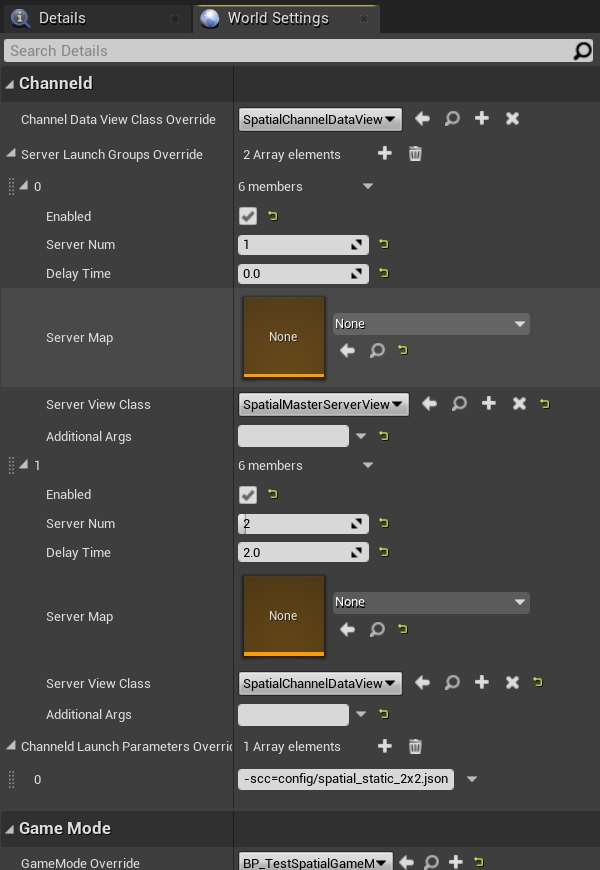

# 世界场景设置
从v0.7.4版本开始，ChanneldUE附带了一个工具类`ChanneldWorldSettings`，可以用于关卡特有的channelld相关启动设置。

该工具类适用于那些有多个关卡，每个关卡都有不同启动设置（如`Channel Data View Class`和`Server Groups`）的项目，比如说[ChanneldUE示例项目](https://github.com/metaworking/channeld-ue-demos) 。在有`ChanneldWorldSettings`之前，每次打开不同的关卡，你可能需要手动设置项目设置中的`Channel Data View Class`和编辑器偏好设置中的`Server Groups`。现在，你可以在`ChanneldWorldSettings`中覆盖这些值，并将其保存在关卡中。

要使用`ChanneldWorldSettings`，打开项目设置并导航到`引擎 > 一般设置`。在`Default Classes`类别下，将`场景设置类`设为`ChanneldWorldSettings`。之后你需要重新启动编辑器。

以下是与ChanneldUE示例项目中的`TestSpatial_2x2`地图对应的世界设置窗口的截图：



`ChanneldWorldSettings`类有以下属性：

- `Channel Data View Class Override`：它覆盖了项目设置中的`Channel Data View Class`。
- `Server Launch Groups Override`：它覆盖了编辑器偏好设置中的`Server Groups`*整个数组*。
- `Channeld Launch Parameters Override`：它只覆盖了编辑器偏好设置中`Channeld Launch Parameters`中具有*相同键*的参数。如果键在编辑器偏好设置中不存在，则会添加到`Channeld Launch Parameters`中。

## 移除关卡中重复的世界设置Actor
将`场景设置类`设为`ChanneldWorldSettings`后，可能会出现关卡中有两个`World Settings`的情况。如果是这样，日志中将在UE4中给出以下警告：
```log
LogLevel:  Detected duplicate WorldSettings actor - UE-62934
```
在UE5中是这样：
```log
LogWorld: Warning: Extra World Settings '/Game/Maps/<LevelName>:PersistentLevel.WorldSettings_0' actor found. Resave level to clean up.
```

要移除重复的世界设置Actor，你可以使用ChanneldUE中的工具：在ChanneldUE工具栏的下拉菜单中，选择`Advanced... > Remove Duplicate World Settings Actors`。此操作会自动保存当前关卡资产。
